# KrishiFarms CRM — Android Architecture Document

**Version:** 1.0  
**Status:** Initial Design (layer reference)  
**Audience:** Engineering, Product, Security Review  
**Author:** Principal Android Architecture  
**Last Updated:** June 2025

> **Product & rollout spec:** For the expanded CRM target — multi-module Gradle layout, bottom navigation, design system, user roles, wireframes, phased implementation, and migration from today's single `:app` drawer shell — see **[PRODUCT_ARCHITECTURE.md](PRODUCT_ARCHITECTURE.md)**. This document remains the canonical reference for **layer boundaries**, Room schema detail, security, sync protocol, and repository patterns. The **target multi-module split** (`:app`, `:core:*`, `:domain`, `:data`, `:feature:*`) is specified in [PRODUCT_ARCHITECTURE.md §2](PRODUCT_ARCHITECTURE.md#2-complete-project-structure); execution is planned for Phase 4 of the product rollout while code continues in `:app` until then.

---

## Table of Contents

1. [Executive Summary](#1-executive-summary)
2. [Mobile Architecture](#2-mobile-architecture)
3. [Package Structure](#3-package-structure)
4. [Navigation Design](#4-navigation-design)
5. [Offline Sync Design](#5-offline-sync-design)
6. [Room Database Design](#6-room-database-design)
7. [Repository Design](#7-repository-design)
8. [State Management Strategy](#8-state-management-strategy)
9. [Error Handling Strategy](#9-error-handling-strategy)
10. [Security Strategy](#10-security-strategy)
11. [Future AI Readiness](#11-future-ai-readiness)
12. [Appendices](#12-appendices)

---

## 1. Executive Summary

KrishiFarms CRM is an **internal Android application** for field and office operations in agricultural supply-chain management. The app serves **3–10 users initially**, scaling to **100+ users** without architectural rework.

### Design Principles

| Principle | Rationale |
|-----------|-----------|
| **Offline First** | Field users operate in low-connectivity rural areas |
| **Single Source of Truth (Local)** | Room is authoritative on-device; server is authoritative globally after sync |
| **Modular Clean Architecture** | 17 business modules evolve independently |
| **Security by Default** | JWT, RBAC, encrypted storage, certificate pinning |
| **Observable & Testable** | Unidirectional data flow, interface-driven layers |
| **Sync-Aware UX** | Users always know connectivity and sync state |

### Technology Stack

| Layer | Technology |
|-------|------------|
| Language | Kotlin |
| UI | Jetpack Compose, Material 3 |
| Architecture | MVVM + Clean Architecture |
| DI | Hilt |
| Navigation | Navigation Compose |
| Networking | Retrofit, OkHttp, Kotlinx Serialization |
| Local DB | Room |
| Preferences | DataStore (Proto preferred for typed schemas) |
| Background Work | WorkManager |
| Camera | CameraX |
| i18n | Android Resources + Compose string resources (en, te) |
| Backend | FastAPI, JWT, REST |

---

## 2. Mobile Architecture

### 2.1 Layered Architecture

The application follows **Clean Architecture** with three primary layers and a cross-cutting **Core** module.

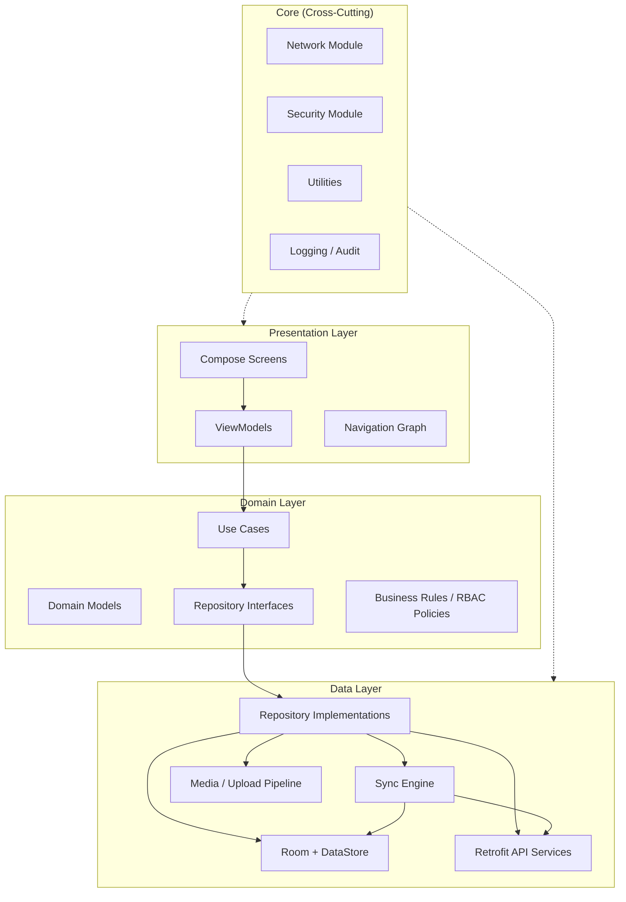

### 2.2 Layer Responsibilities

#### Presentation Layer
- **Compose Screens**: Stateless UI; receive `UiState` and emit `UiEvent`
- **ViewModels**: Orchestrate use cases, expose `StateFlow<UiState>`, handle lifecycle-aware collection
- **Navigation**: Type-safe routes, deep links, role-gated destinations
- **No business logic** beyond UI validation and formatting

#### Domain Layer
- **Pure Kotlin** — no Android framework dependencies
- **Use Cases**: Single-responsibility operations (e.g., `CreateFarmerUseCase`, `SyncPendingChangesUseCase`)
- **Domain Models**: Immutable data classes decoupled from Room entities and API DTOs
- **Repository Interfaces**: Contracts consumed by use cases
- **RBAC Policy Engine**: Centralized permission checks independent of UI

#### Data Layer
- **Repository Implementations**: Mediate between local and remote sources
- **Mappers**: Entity ↔ Domain ↔ DTO transformations
- **Sync Engine**: Conflict resolution, change tracking, retry orchestration
- **Media Pipeline**: CameraX capture → local staging → background upload

### 2.3 Module Strategy (Gradle)

**Current (`initial-commit`):** Single `:app` module with feature packages under `com.krishifarms.mobile.feature.*`. Multi-module includes are commented in `settings.gradle.kts`.

**Target:** Monorepo multi-module per [PRODUCT_ARCHITECTURE.md §2](PRODUCT_ARCHITECTURE.md#2-complete-project-structure). Split execution is Phase 4; until then, preserve package boundaries inside `:app` to ease extraction.

For initial scale (3–10 users), a **monorepo multi-module** approach balances velocity and boundaries. Split further when team size or build times demand it.

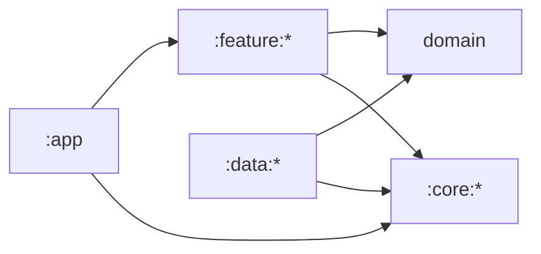

| Module | Purpose |
|--------|---------|
| `:app` | Application entry, Hilt graph root, navigation host, theme |
| `:core:common` | Result types, extensions, dispatchers |
| `:core:network` | OkHttp, Retrofit, interceptors, API base config |
| `:core:database` | Room database, DAOs, migrations |
| `:core:datastore` | Preferences, session, sync metadata |
| `:core:security` | Keystore, encryption, token vault |
| `:core:sync` | Sync engine, WorkManager workers |
| `:core:ui` | Design system, shared Compose components |
| `:core:i18n` | Locale utilities, bilingual helpers |
| `:domain` | Use cases, models, repository interfaces |
| `:data` | Repository implementations, mappers, media |
| `:feature:auth` | Login, session recovery |
| `:feature:dashboard` | Home, KPIs, quick actions |
| `:feature:farmers` | Farmer CRUD, search |
| `:feature:farms` | Farm management |
| `:feature:procurement` | Crop procurement |
| `:feature:payments` | Farmer payments, collections, payments |
| `:feature:workforce` | Workers, work orders, attendance |
| `:feature:expenses` | Expense tracking |
| `:feature:fleet` | Vehicles, trips |
| `:feature:assets` | Assets, rentals |
| `:feature:documents` | Document management, camera |
| `:feature:settings` | Profile, language, sync status |

**Dependency rule:** `feature → domain → (interfaces only)`. `data` implements domain interfaces. Features never depend on `data` directly.

### 2.4 Data Flow (Unidirectional)

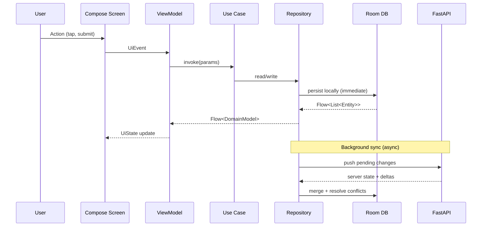

### 2.5 Dependency Injection (Hilt)

| Scope | Bindings |
|-------|----------|
| `@Singleton` | Database, Retrofit, OkHttp, SyncEngine, TokenManager |
| `@ViewModelScoped` | Feature-specific coordinators (rare; prefer stateless VMs) |
| `@ActivityRetainedScoped` | Navigation state holders if needed |

**Modules:**
- `NetworkModule` — Retrofit services, interceptors
- `DatabaseModule` — Room instance, DAO providers
- `DataStoreModule` — Proto DataStore instances
- `RepositoryModule` — `@Binds` interface → implementation
- `SyncModule` — Workers, sync schedulers
- `SecurityModule` — Encrypted storage, biometric gate (future)

### 2.6 Background Processing

| Work Type | Mechanism |
|-----------|-----------|
| Periodic sync | `PeriodicWorkRequest` (15 min minimum; configurable) |
| Push pending changes | `OneTimeWorkRequest` on connectivity restore |
| Image upload queue | Chained `OneTimeWorkRequest` with retry/backoff |
| Token refresh | OkHttp `Authenticator` + fallback worker |
| Audit log flush | Batched upload via WorkManager |

**Constraints:** `NetworkType.CONNECTED`, `RequiresBatteryNotLow` for heavy sync; expedited work only for critical auth refresh.

### 2.7 Camera & Media Architecture

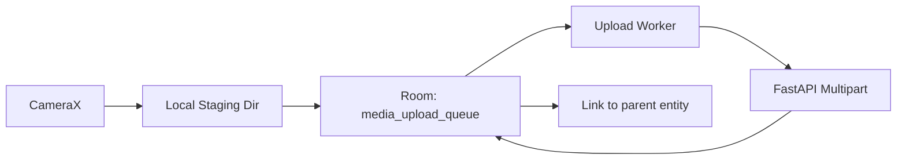

- Captured images stored in **app-private encrypted directory**
- Thumbnail generation on IO dispatcher
- Upload references stored in `media_upload_queue` table
- Parent entity (farmer photo, document scan, expense receipt) holds `localMediaId` until server `remoteUrl` confirmed

---

## 3. Package Structure

Root package: `com.krishifarms.crm`

### 3.1 Top-Level Layout

```
com.krishifarms.crm
├── app/                          # Application class, MainActivity, NavHost
├── core/
│   ├── common/
│   │   ├── result/               # AppResult, SyncResult sealed types
│   │   ├── dispatcher/           # DispatcherProvider
│   │   ├── extension/
│   │   └── util/                 # Date, currency (INR), validators
│   ├── network/
│   │   ├── api/                  # Retrofit service interfaces
│   │   ├── interceptor/          # Auth, logging, connectivity
│   │   ├── dto/                  # Request/response DTOs
│   │   └── authenticator/        # Token refresh
│   ├── database/
│   │   ├── entity/               # Room entities
│   │   ├── dao/                  # Data access objects
│   │   ├── migration/            # Schema migrations
│   │   └── converter/            # Type converters
│   ├── datastore/
│   │   ├── proto/                # Proto schemas
│   │   └── repository/           # Settings, session preferences
│   ├── security/
│   │   ├── keystore/
│   │   ├── encryption/
│   │   └── rbac/                 # Permission matrix, PolicyEvaluator
│   ├── sync/
│   │   ├── engine/               # SyncOrchestrator, ConflictResolver
│   │   ├── worker/               # WorkManager workers
│   │   └── model/                # SyncStatus, ChangeSet
│   └── ui/
│       ├── theme/                # Color, typography, shapes
│       ├── component/            # Buttons, fields, cards, dialogs
│       ├── state/                # SyncIndicator, LoadingState
│       └── locale/               # Locale-aware formatters
├── domain/
│   ├── model/                    # Domain models per entity
│   ├── repository/               # Repository interfaces
│   └── usecase/
│       ├── auth/
│       ├── farmer/
│       ├── farm/
│       ├── procurement/
│       ├── payment/
│       ├── worker/
│       ├── workorder/
│       ├── attendance/
│       ├── expense/
│       ├── collection/
│       ├── vehicle/
│       ├── trip/
│       ├── asset/
│       ├── rental/
│       ├── document/
│       ├── sync/
│       └── audit/
├── data/
│   ├── repository/               # Repository implementations
│   ├── mapper/                   # Entity/DTO ↔ Domain
│   ├── media/                    # Camera, upload pipeline
│   └── source/
│       ├── local/                # DAO wrappers
│       └── remote/               # API source classes
└── feature/
    ├── auth/
    │   ├── login/
    │   │   ├── LoginScreen.kt
    │   │   ├── LoginViewModel.kt
    │   │   └── LoginUiState.kt
    │   └── navigation/
    ├── dashboard/
    ├── farmers/
    ├── farms/
    ├── procurement/
    ├── farmerpayments/
    ├── workers/
    ├── workorders/
    ├── attendance/
    ├── expenses/
    ├── collections/
    ├── payments/
    ├── vehicles/
    ├── vehicletrips/
    ├── assets/
    ├── rentals/
    ├── documents/
    └── settings/
```

### 3.2 Feature Module Internal Convention

Each feature follows a consistent internal structure:

```
feature/<name>/
├── navigation/       # Route definitions, NavGraph extension
├── list/             # List screen + VM + UiState
├── detail/           # Detail screen
├── form/             # Create/Edit screen
├── component/        # Feature-specific composables
└── di/               # Feature Hilt module (if needed)
```

### 3.3 Naming Conventions

| Artifact | Convention | Example |
|----------|------------|---------|
| Screen | `<Entity><Action>Screen` | `FarmerListScreen` |
| ViewModel | `<Entity><Action>ViewModel` | `FarmerListViewModel` |
| UiState | `<Entity><Action>UiState` | `FarmerListUiState` |
| UiEvent | `<Entity><Action>UiEvent` | `FarmerListUiEvent` |
| Use Case | `<Verb><Entity>UseCase` | `GetFarmersUseCase` |
| Repository | `<Entity>Repository` | `FarmerRepository` |
| DAO | `<Entity>Dao` | `FarmerDao` |
| Entity | `<Entity>Entity` | `FarmerEntity` |
| DTO | `<Entity>Dto` | `FarmerDto` |

---

## 4. Navigation Design

### 4.1 Navigation Topology

The app uses a **single-activity** architecture with a **bottom navigation bar** for primary modules and nested graphs for drill-down flows.

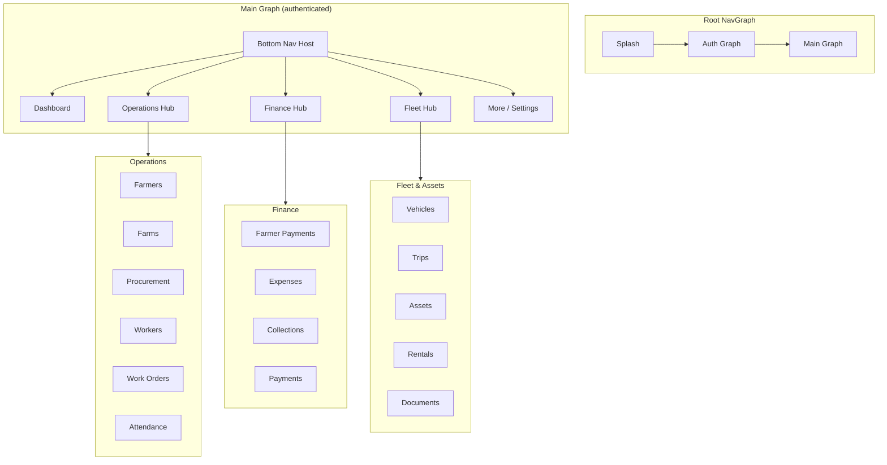

### 4.2 Route Design (Type-Safe)

Use **Kotlin Serialization** or Navigation Compose typed routes (Navigation 2.8+).

| Route Pattern | Example | Notes |
|---------------|---------|-------|
| List | `farmers` | Entry point per module |
| Detail | `farmers/{farmerId}` | UUID path segment |
| Form (create) | `farmers/create` | |
| Form (edit) | `farmers/{farmerId}/edit` | |
| Nested child | `farms/{farmId}/procurement` | Contextual sub-flow |
| Document capture | `documents/capture?parentType=&parentId=` | Returns result via SavedStateHandle |

### 4.3 Bottom Navigation (Role-Aware)

| Tab | Default Visible Roles | Badge |
|-----|---------------------|-------|
| Dashboard | All | Sync pending count |
| Operations | Field Manager, Supervisor, Admin | — |
| Finance | Accountant, Admin | Pending approvals |
| Fleet | Logistics, Admin | — |
| More | All | — |

**RBAC at navigation:** `NavController` graph is filtered at composition time based on `UserRole.permissions`. Unauthorized deep links redirect to Dashboard with snackbar.

### 4.4 Navigation State & Back Stack

- **List → Detail → Edit**: Standard hierarchical back stack
- **Modal flows** (camera capture, payment approval): Separate sub-graph with `popUpTo` inclusive on completion
- **Global search**: Overlay destination; does not pollute module back stacks
- **Sync conflict resolution**: Modal bottom sheet destination shared across modules

### 4.5 Deep Links (Future)

| Link | Target |
|------|--------|
| `krishifarms://farmer/{id}` | Farmer detail |
| `krishifarms://workorder/{id}` | Work order detail |
| `krishifarms://sync` | Sync status screen |

Reserved for push notifications (Phase 2).

### 4.6 Screen Inventory by Module

| Module | Screens |
|--------|---------|
| Authentication | Splash, Login, Session Expired, Forgot Password (admin-assisted) |
| Dashboard | Home, KPI cards, Recent activity, Quick actions |
| Farmers | List (search + pagination), Detail, Create/Edit, Audit history |
| Farms | List, Detail, Create/Edit, Map view (future), Linked farmers |
| Crop Procurement | List, Detail, Create/Edit, Weighment capture |
| Farmer Payments | List, Detail, Create, Approval flow |
| Workers | List, Detail, Create/Edit |
| Work Orders | List, Detail, Create/Edit, Assignment, Status updates |
| Attendance | Daily log, Worker check-in/out, Calendar view |
| Expenses | List, Detail, Create (receipt camera), Approval |
| Collections | List, Detail, Create |
| Payments | List, Detail, Create |
| Vehicles | List, Detail, Create/Edit |
| Vehicle Trips | List, Detail, Create/Edit, Trip log |
| Assets | List, Detail, Create/Edit |
| Rentals | List, Detail, Create/Edit |
| Documents | List, Viewer, Camera capture, Upload queue |
| Settings | Profile, Language (en/te), Sync status, About, Logout |

---

## 5. Offline Sync Design

### 5.1 Sync Philosophy

**Local-first writes:** Every user mutation writes to Room immediately and returns success to the UI. Sync to server is asynchronous and retryable.

**Server authority:** On conflict, server wins for financial and inventory records unless business rules define merge strategies. Field notes and drafts may use last-write-wins with audit trail.

### 5.2 Sync Architecture

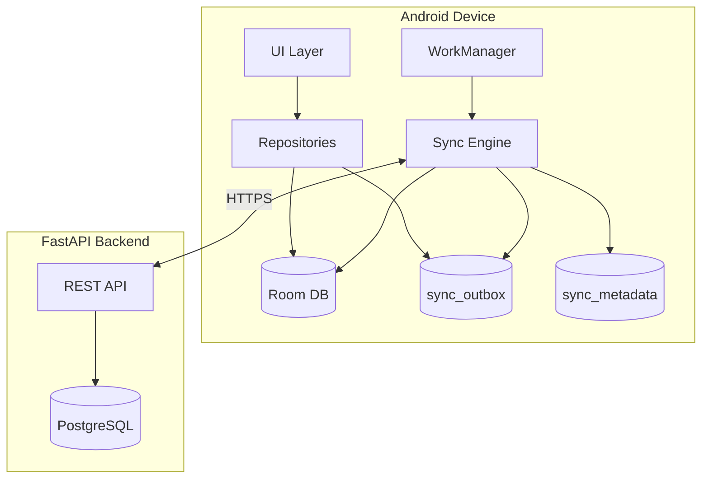

### 5.3 Change Tracking Model

Every syncable entity includes:

| Field | Purpose |
|-------|---------|
| `id` | Client-generated UUID (v4) |
| `remoteId` | Server-assigned ID after first sync |
| `createdAt` | Client timestamp (ISO-8601 UTC) |
| `updatedAt` | Last local mutation |
| `serverUpdatedAt` | Last known server timestamp |
| `syncStatus` | `SYNCED`, `PENDING_CREATE`, `PENDING_UPDATE`, `PENDING_DELETE`, `CONFLICT`, `ERROR` |
| `isDeleted` | Soft delete flag (tombstone) |
| `version` | Optimistic concurrency counter |
| `lastSyncedAt` | Last successful sync timestamp |

**Outbox table (`sync_outbox`):**

| Column | Description |
|--------|-------------|
| `outboxId` | Auto-increment PK |
| `entityType` | e.g., `farmer`, `expense` |
| `entityId` | Local UUID |
| `operation` | CREATE, UPDATE, DELETE |
| `payload` | JSON snapshot of change |
| `createdAt` | Enqueue time |
| `retryCount` | Failed attempt counter |
| `lastError` | Last failure message |
| `priority` | CRITICAL, NORMAL, LOW |

### 5.4 Sync Protocol

#### Push (Client → Server)

1. WorkManager triggers `SyncPushWorker`
2. Engine reads `sync_outbox` ordered by `priority`, `createdAt`
3. Batch up to N records per entity type (configurable; default 50)
4. `POST /sync/push` with JWT — body: `{ changes: [...], deviceId, lastPullCursor }`
5. Server validates, applies, returns `{ accepted: [...], rejected: [...], conflicts: [...] }`
6. Engine updates local entities and clears outbox entries

#### Pull (Server → Client)

1. `SyncPullWorker` runs after successful push (or on schedule)
2. `GET /sync/pull?cursor={lastCursor}&modules={...}`
3. Server returns delta changes since cursor
4. Engine applies to Room in a single transaction
5. Update `sync_metadata.lastPullCursor`

#### Full Resync (Recovery)

Triggered on: schema migration, auth re-login, unrecoverable corruption, admin command.

1. Clear module-specific tables (preserve unsynced outbox)
2. Paginated `GET /{module}?page=&size=` until exhausted
3. Rebuild local indexes

### 5.5 Conflict Resolution

| Entity Category | Strategy | Example |
|-----------------|----------|---------|
| Financial (payments, collections) | Server wins + flag conflict for review | Payment amount mismatch |
| Master data (farmers, farms) | Field-level merge where safe; else server wins | Phone number updated on two devices |
| Operational (attendance, trips) | Last-write-wins with audit | Check-in time |
| Documents / media | Immutable after upload; retry upload only | Receipt photo |

**Conflict UI:** Conflicts surface in Settings → Sync Status and as module-level banners. User can view diff and accept server or re-submit local (if permitted by role).

### 5.6 Sync State Machine

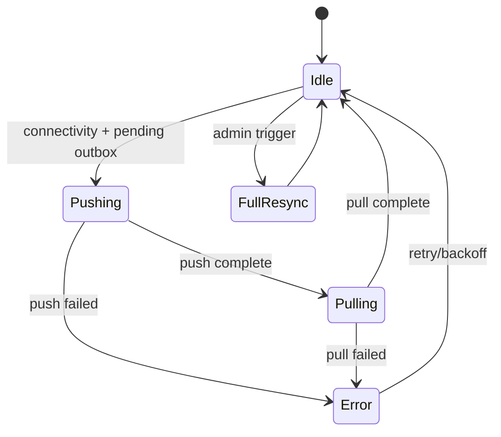

### 5.7 Connectivity Strategy

- `ConnectivityManager` + `NetworkCallback` registers online/offline transitions
- On online: enqueue expedited push worker
- Offline banner in app shell (persistent, dismissible per session)
- Reads always from Room — never block UI on network

### 5.8 Sync Observability

Expose via `SyncRepository.syncStatus: StateFlow<SyncState>`:

| Field | UI Use |
|-------|--------|
| `isOnline` | Connectivity indicator |
| `isSyncing` | Progress bar |
| `pendingChangesCount` | Badge on More tab |
| `lastSyncTime` | Settings display |
| `conflictCount` | Alert |
| `failedUploadCount` | Media queue warning |

### 5.9 API Contract Assumptions (Backend Coordination)

Backend must expose:

- `POST /auth/login`, `POST /auth/refresh`, `POST /auth/logout`
- `POST /sync/push`, `GET /sync/pull`
- Per-module CRUD with pagination: `GET /farmers?page=1&size=20&search=&sort=`
- `POST /media/upload` (multipart)
- `GET /audit/{entityType}/{entityId}`
- Cursor-based sync cursors stored server-side per device

---

## 6. Room Database Design

### 6.1 Database Overview

| Property | Value |
|----------|-------|
| Database name | `krishifarms_crm.db` |
| Current version | 1 (increment per migration) |
| Strategy | Single database, multiple DAOs |
| Encryption | SQLCipher (via Room + SQLCipher adapter) recommended for production |

### 6.2 Entity Relationship (High-Level)

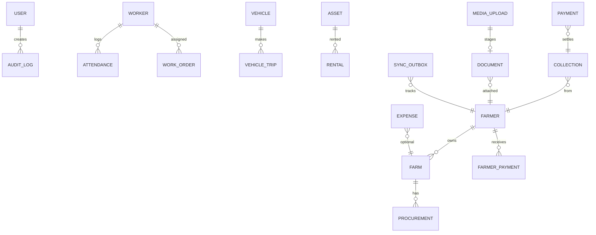

### 6.3 Core Tables

#### `users` (cached session user + role)

| Column | Type | Notes |
|--------|------|-------|
| id | TEXT PK | UUID |
| username | TEXT | |
| displayName | TEXT | |
| role | TEXT | ADMIN, MANAGER, ACCOUNTANT, FIELD_OFFICER, SUPERVISOR |
| permissions | TEXT | JSON array |
| lastLoginAt | TEXT | |

#### `farmers`

| Column | Type | Notes |
|--------|------|-------|
| id | TEXT PK | Client UUID |
| remoteId | TEXT | Nullable until synced |
| name | TEXT | Indexed |
| nameTe | TEXT | Telugu name |
| phone | TEXT | Unique index |
| aadhaarLast4 | TEXT | Masked |
| village | TEXT | Indexed |
| district | TEXT | |
| bankAccount | TEXT | Encrypted at app level |
| ifsc | TEXT | |
| notes | TEXT | |
| + sync columns | | See §5.3 |

#### `farms`

| Column | Type | Notes |
|--------|------|-------|
| id | TEXT PK | |
| farmerId | TEXT FK | → farmers.id |
| name | TEXT | |
| location | TEXT | |
| areaAcres | REAL | |
| cropType | TEXT | |
| geoLat | REAL | Nullable |
| geoLng | REAL | Nullable |
| + sync columns | | |

#### `procurements`

| Column | Type | Notes |
|--------|------|-------|
| id | TEXT PK | |
| farmId | TEXT FK | |
| farmerId | TEXT FK | Denormalized for query |
| cropType | TEXT | |
| quantityKg | REAL | |
| ratePerKg | REAL | |
| totalAmount | REAL | |
| procuredAt | TEXT | |
| status | TEXT | DRAFT, CONFIRMED, PAID |
| + sync columns | | |

#### `farmer_payments`

| Column | Type | Notes |
|--------|------|-------|
| id | TEXT PK | |
| farmerId | TEXT FK | |
| procurementId | TEXT FK | Nullable |
| amount | REAL | |
| paymentMode | TEXT | CASH, UPI, BANK |
| referenceNo | TEXT | |
| paidAt | TEXT | |
| status | TEXT | PENDING, APPROVED, REJECTED |
| + sync columns | | |

#### `workers`

| Column | Type | Notes |
|--------|------|-------|
| id | TEXT PK | |
| name | TEXT | |
| phone | TEXT | |
| role | TEXT | |
| dailyWage | REAL | |
| isActive | INTEGER | Boolean |
| + sync columns | | |

#### `work_orders`

| Column | Type | Notes |
|--------|------|-------|
| id | TEXT PK | |
| title | TEXT | |
| description | TEXT | |
| assignedWorkerId | TEXT FK | Nullable |
| farmId | TEXT FK | Nullable |
| priority | TEXT | LOW, MEDIUM, HIGH |
| status | TEXT | OPEN, IN_PROGRESS, DONE, CANCELLED |
| dueDate | TEXT | |
| + sync columns | | |

#### `attendance`

| Column | Type | Notes |
|--------|------|-------|
| id | TEXT PK | |
| workerId | TEXT FK | |
| date | TEXT | Indexed (workerId + date) unique |
| checkIn | TEXT | |
| checkOut | TEXT | Nullable |
| hoursWorked | REAL | |
| + sync columns | | |

#### `expenses`

| Column | Type | Notes |
|--------|------|-------|
| id | TEXT PK | |
| category | TEXT | |
| amount | REAL | |
| description | TEXT | |
| farmId | TEXT FK | Nullable |
| receiptMediaId | TEXT FK | → media_uploads |
| expenseDate | TEXT | |
| status | TEXT | |
| + sync columns | | |

#### `collections`

| Column | Type | Notes |
|--------|------|-------|
| id | TEXT PK | |
| farmerId | TEXT FK | |
| amount | REAL | |
| collectionDate | TEXT | |
| mode | TEXT | |
| + sync columns | | |

#### `payments` (outgoing operational payments)

| Column | Type | Notes |
|--------|------|-------|
| id | TEXT PK | |
| payeeName | TEXT | |
| amount | REAL | |
| category | TEXT | |
| paymentDate | TEXT | |
| + sync columns | | |

#### `vehicles`

| Column | Type | Notes |
|--------|------|-------|
| id | TEXT PK | |
| registrationNo | TEXT | Unique |
| type | TEXT | |
| capacity | TEXT | |
| status | TEXT | ACTIVE, MAINTENANCE, RETIRED |
| + sync columns | | |

#### `vehicle_trips`

| Column | Type | Notes |
|--------|------|-------|
| id | TEXT PK | |
| vehicleId | TEXT FK | |
| driverName | TEXT | |
| startLocation | TEXT | |
| endLocation | TEXT | |
| startTime | TEXT | |
| endTime | TEXT | Nullable |
| distanceKm | REAL | |
| purpose | TEXT | |
| + sync columns | | |

#### `assets`

| Column | Type | Notes |
|--------|------|-------|
| id | TEXT PK | |
| name | TEXT | |
| category | TEXT | |
| purchaseDate | TEXT | |
| purchaseValue | REAL | |
| currentValue | REAL | |
| status | TEXT | |
| + sync columns | | |

#### `rentals`

| Column | Type | Notes |
|--------|------|-------|
| id | TEXT PK | |
| assetId | TEXT FK | |
| renterName | TEXT | |
| startDate | TEXT | |
| endDate | TEXT | Nullable |
| ratePerDay | REAL | |
| status | TEXT | |
| + sync columns | | |

#### `documents`

| Column | Type | Notes |
|--------|------|-------|
| id | TEXT PK | |
| parentType | TEXT | FARMER, FARM, EXPENSE, etc. |
| parentId | TEXT | |
| title | TEXT | |
| documentType | TEXT | AADHAAR, LAND_RECORD, RECEIPT, OTHER |
| mediaId | TEXT FK | |
| uploadedAt | TEXT | |
| + sync columns | | |

### 6.4 Infrastructure Tables

#### `media_uploads`

| Column | Type |
|--------|------|
| id | TEXT PK |
| localPath | TEXT |
| remoteUrl | TEXT Nullable |
| mimeType | TEXT |
| fileSize | INTEGER |
| uploadStatus | TEXT (PENDING, UPLOADING, COMPLETE, FAILED) |
| retryCount | INTEGER |
| createdAt | TEXT |

#### `sync_outbox` — See §5.3

#### `sync_metadata`

| Column | Type |
|--------|------|
| key | TEXT PK |
| value | TEXT |

Keys: `last_pull_cursor`, `last_push_at`, `device_id`, `schema_version`

#### `audit_logs`

| Column | Type |
|--------|------|
| id | TEXT PK |
| entityType | TEXT |
| entityId | TEXT |
| action | TEXT (CREATE, UPDATE, DELETE, VIEW) |
| userId | TEXT |
| timestamp | TEXT |
| changesJson | TEXT (field-level diff) |
| syncStatus | TEXT |

### 6.5 Indexing Strategy

| Index | Columns | Purpose |
|-------|---------|---------|
| `idx_farmer_name` | farmers(name) | Search |
| `idx_farmer_phone` | farmers(phone) | Lookup |
| `idx_farmer_village` | farmers(village) | Filter |
| `idx_farm_farmer` | farms(farmerId) | Join |
| `idx_sync_status` | *.(syncStatus) | Pending sync queries |
| `idx_outbox_priority` | sync_outbox(priority, createdAt) | Push ordering |
| `idx_audit_entity` | audit_logs(entityType, entityId) | History screen |
| `idx_attendance_worker_date` | attendance(workerId, date) UNIQUE | Duplicate prevention |

### 6.6 Pagination (Local)

Room `PagingSource` backed queries:

```sql
SELECT * FROM farmers
WHERE syncStatus != 'PENDING_DELETE'
  AND (name LIKE '%' || :query || '%' OR phone LIKE '%' || :query || '%')
ORDER BY name ASC
```

Remote pagination via `RemoteMediator` when online — merges server pages into Room.

### 6.7 Migration Policy

- **Additive migrations preferred** — new columns with defaults
- Destructive migration **only in debug** builds
- Production: explicit `Migration` objects with rollback plan
- Schema export enabled for CI validation

---

## 7. Repository Design

### 7.1 Repository Pattern

Each domain aggregate has a repository interface in `:domain` and implementation in `:data`.

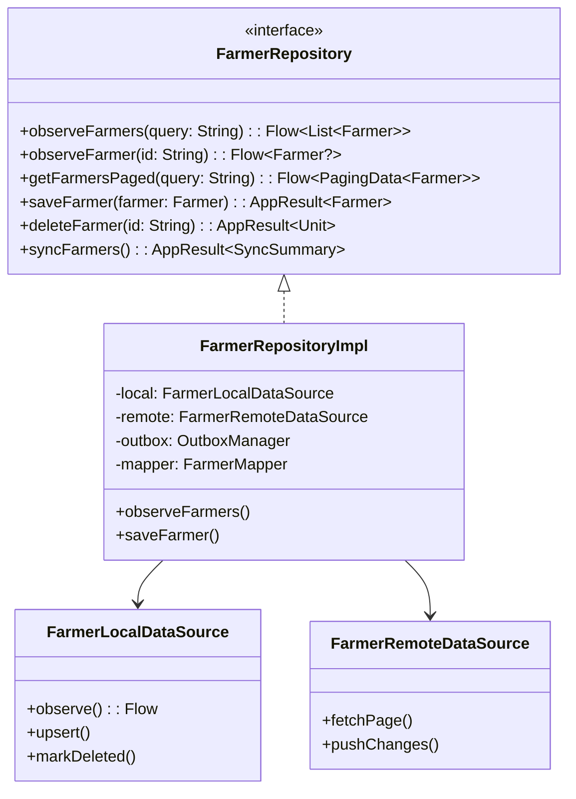

### 7.2 Repository Catalog

| Repository | Primary Entity | Remote Endpoints |
|------------|----------------|------------------|
| `AuthRepository` | Session, tokens | `/auth/*` |
| `UserRepository` | User profile | `/users/me` |
| `FarmerRepository` | Farmer | `/farmers` |
| `FarmRepository` | Farm | `/farms` |
| `ProcurementRepository` | Procurement | `/procurements` |
| `FarmerPaymentRepository` | FarmerPayment | `/farmer-payments` |
| `WorkerRepository` | Worker | `/workers` |
| `WorkOrderRepository` | WorkOrder | `/work-orders` |
| `AttendanceRepository` | Attendance | `/attendance` |
| `ExpenseRepository` | Expense | `/expenses` |
| `CollectionRepository` | Collection | `/collections` |
| `PaymentRepository` | Payment | `/payments` |
| `VehicleRepository` | Vehicle | `/vehicles` |
| `VehicleTripRepository` | VehicleTrip | `/vehicle-trips` |
| `AssetRepository` | Asset | `/assets` |
| `RentalRepository` | Rental | `/rentals` |
| `DocumentRepository` | Document | `/documents` |
| `MediaRepository` | MediaUpload | `/media/upload` |
| `AuditRepository` | AuditLog | `/audit` |
| `SyncRepository` | SyncMetadata | `/sync/*` |
| `SearchRepository` | Cross-entity | `/search?q=` |

### 7.3 Read Path

1. Repository returns `Flow` from Room DAO (always)
2. If stale (optional TTL) and online, trigger background refresh via sync engine
3. UI collects Flow in ViewModel with `stateIn(WhileSubscribed(5000))`

### 7.4 Write Path

1. Validate in Use Case (domain rules)
2. Map domain model → entity
3. Set `syncStatus = PENDING_CREATE | PENDING_UPDATE`
4. Room transaction: upsert entity + insert outbox row + insert audit log
5. Return `AppResult.Success` immediately
6. Enqueue `SyncPushWorker`

### 7.5 Delete Path

- Soft delete: `isDeleted = true`, `syncStatus = PENDING_DELETE`
- Hard delete locally only after server confirms tombstone

### 7.6 Search Repository

Unified search aggregates local FTS across modules:

| Source | Fields |
|--------|--------|
| Farmers | name, nameTe, phone, village |
| Farms | name, location |
| Workers | name, phone |
| Vehicles | registrationNo |
| Work Orders | title |

**Phase 1:** SQL `LIKE` with indexes  
**Phase 2:** Room FTS4 virtual tables for Telugu transliteration support

### 7.7 Media Repository

| Operation | Behavior |
|-----------|----------|
| `stageCapture(uri)` | Copy to encrypted staging, create `media_uploads` row |
| `observeUploadQueue()` | Flow for settings UI |
| `retryFailed()` | Re-enqueue WorkManager |
| `linkToEntity(mediaId, parent)` | Update document/entity FK |

---

## 8. State Management Strategy

### 8.1 UiState Pattern

Each screen defines an immutable `UiState` data class:

| Field Category | Examples |
|----------------|----------|
| Content | `items`, `detail`, `formFields` |
| Status | `isLoading`, `isRefreshing`, `isSaving` |
| Error | `error: UiError?` |
| Sync | `isOffline`, `hasPendingSync` |
| Pagination | `PagingData` via separate Flow |

### 8.2 State Exposure

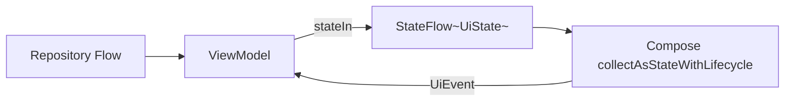

**Rules:**
- ViewModels expose `StateFlow`, never mutable state to UI
- Use `WhileSubscribed(5000)` to balance lifecycle and upstream collection
- Separate one-off events via `Channel` → `Flow` (`UiEventEffect`) for navigation, snackbars

### 8.3 Global App State

| State | Holder | Consumers |
|-------|--------|-----------|
| Auth session | `SessionManager` (singleton) | Nav graph, interceptors |
| Sync status | `SyncRepository.syncState` | App shell banner, badges |
| Locale | `LocaleManager` | Activity recreation / Compose LocalConfiguration |
| RBAC permissions | `PermissionProvider` | Conditional UI, navigation |

### 8.4 Form State

- **Simple forms:** `UiState` with field map + validation errors
- **Complex forms:** Dedicated `FormState` holder within ViewModel
- **Draft persistence:** Save draft to Room on `onStop` for long forms (procurement, expenses)

### 8.5 Loading & Empty States

Standardized in `:core:ui`:

| State | Component |
|-------|-----------|
| Initial load | `LoadingScreen` |
| Empty list | `EmptyState` with localized message + CTA |
| Error | `ErrorState` with retry |
| Offline | `OfflineBanner` |
| Syncing | `SyncProgressIndicator` |

### 8.6 Configuration Changes

- ViewModels retain state across rotation
- Camera capture uses dedicated `Activity` or `rememberLauncherForActivityResult` with file output — ViewModel holds pending `mediaId`

---

## 9. Error Handling Strategy

### 9.1 Result Type Hierarchy

```
AppResult<T>
├── Success(data: T)
├── Error(error: AppError)
└── Loading (optional, for one-shot operations)
```

```
AppError
├── NetworkError (timeout, no connection, server unreachable)
├── HttpError (status code, server message)
├── AuthError (token expired, forbidden)
├── ValidationError (field-level map)
├── SyncError (conflict, outbox failure)
├── DatabaseError
├── MediaError (capture failed, upload failed)
└── UnknownError (throwable)
```

### 9.2 Layer-Specific Handling

| Layer | Responsibility |
|-------|----------------|
| **Remote** | Map HTTP codes to `AppError`; parse FastAPI validation errors (`422`) |
| **Repository** | Catch IO/SQL exceptions; never leak to domain |
| **Use Case** | Apply business validation; return `ValidationError` |
| **ViewModel** | Map `AppError` → `UiError` (user-friendly, localized) |
| **UI** | Render error state; offer retry where applicable |

### 9.3 HTTP Error Mapping

| Status | AppError | User Message (en) |
|--------|----------|-------------------|
| 400 | `ValidationError` | Field-specific |
| 401 | `AuthError.Expired` | Session expired, redirect login |
| 403 | `AuthError.Forbidden` | No permission |
| 404 | `HttpError.NotFound` | Record not found |
| 409 | `SyncError.Conflict` | Conflict detected |
| 422 | `ValidationError` | Server validation |
| 500+ | `NetworkError.Server` | Server error, try later |

### 9.4 Retry Policy

| Operation | Strategy |
|-----------|----------|
| Idempotent GET | 3 retries, exponential backoff |
| Sync push | WorkManager backoff (10s → 1hr cap) |
| Media upload | 5 retries; persist failure for manual retry |
| Token refresh | Single attempt; logout on failure |

### 9.5 User-Facing Error UX

| Severity | Presentation |
|----------|--------------|
| Field validation | Inline field error |
| Recoverable | Snackbar with "Retry" action |
| Auth failure | Full-screen session expired |
| Sync conflict | Dedicated conflict resolution screen |
| Critical | Dialog blocking further action |

### 9.6 Logging & Diagnostics

| Level | Destination |
|-------|-------------|
| Debug | Logcat (debug builds only) |
| Error | Structured log → `audit_logs` for user actions; crash reporting (future) |
| Sync failures | `sync_outbox.lastError` + Settings → diagnostic export |

**No PII in logs** — mask phone, Aadhaar, bank details.

### 9.7 Telugu Error Messages

All `UiError` strings in `strings.xml` and `strings-te.xml`. ViewModels reference string resource IDs, not hardcoded text.

---

## 10. Security Strategy

### 10.1 Threat Model (Internal App)

| Threat | Mitigation |
|--------|------------|
| Device theft | App lock PIN (future), short JWT TTL, refresh rotation |
| Token interception | TLS 1.2+, certificate pinning |
| Local data extraction | SQLCipher, encrypted DataStore, encrypted file storage |
| Unauthorized role access | RBAC enforced client + server |
| Audit tampering | Append-only audit log; server-side audit authority |
| Rooted device | Root detection warning (non-blocking for v1) |

### 10.2 Authentication Flow

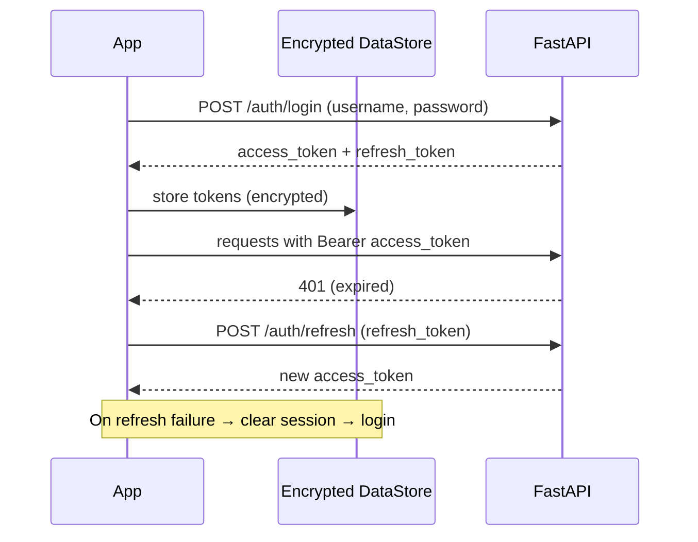

### 10.3 Token Storage

| Token | Storage |
|-------|---------|
| Access token | Encrypted DataStore (memory cache with short TTL) |
| Refresh token | Encrypted DataStore + hardware-backed Keystore wrapper |
| Never | SharedPreferences plaintext, logs, Room unencrypted |

### 10.4 Network Security

- **Certificate pinning** in OkHttp `CertificatePinner` (production certs)
- `network_security_config.xml` — cleartext disabled
- Request/response logging disabled in release
- JWT attached via `AuthInterceptor` — not in query params

### 10.5 Role-Based Access Control

| Role | Permissions (summary) |
|------|----------------------|
| ADMIN | Full access, user management, audit export |
| MANAGER | All modules except user admin; approvals |
| ACCOUNTANT | Finance modules, read-only operations |
| FIELD_OFFICER | Farmers, farms, procurement, attendance (limited) |
| SUPERVISOR | Workers, work orders, attendance, expenses (create) |

**Enforcement layers:**
1. **Navigation** — hide unauthorized destinations
2. **UI** — disable actions (`PermissionProvider.can(Permission.CREATE_FARMER)`)
3. **Use Case** — guard mutations; return `AuthError.Forbidden`
4. **Server** — authoritative enforcement (client is advisory)

Permissions synced on login and stored in `users.permissions` JSON.

### 10.6 Sensitive Field Handling

| Field | Treatment |
|-------|-----------|
| Aadhaar | Store last 4 digits only; full in document scan (encrypted media) |
| Bank account | Encrypted column or encrypted blob |
| Passwords | Never stored locally |
| JWT | Encrypted DataStore |

### 10.7 Image & File Security

- Camera output to app-internal storage (`context.filesDir`)
- `FileProvider` for secure sharing only within app
- Uploaded media over HTTPS multipart
- Delete local staging file after confirmed upload

### 10.8 Session Management

| Policy | Value |
|--------|-------|
| Access token TTL | 15–30 min (server config) |
| Refresh token TTL | 7–30 days |
| Idle timeout (future) | 30 min → re-auth |
| Logout | Clear tokens, Room user cache, cancel workers, optionally wipe PII tables |

### 10.9 Compliance Considerations

- Align with Indian data localization preferences for agricultural/financial records
- Maintain audit trail for financial transactions (7-year retention server-side)
- User consent for camera and storage permissions with Telugu explanations

---

## 11. Future AI Readiness

### 11.1 Design Intent

Architecture should accommodate AI features **without retrofitting** core data flows. AI capabilities are planned as **adjacent services** consuming the same domain layer.

### 11.2 Planned AI Use Cases

| Use Case | Input | Output |
|----------|-------|--------|
| Receipt OCR | Expense receipt image | Amount, vendor, date extraction |
| Document classification | Scanned document | Type (Aadhaar, land record, etc.) |
| Farmer query assistant | Natural language (te/en) | Structured search / summaries |
| Procurement forecasting | Historical procurement data | Suggested quantities |
| Anomaly detection | Payment/collection patterns | Flag unusual transactions |
| Voice input | Telugu speech | Form field population |

### 11.3 AI Integration Architecture

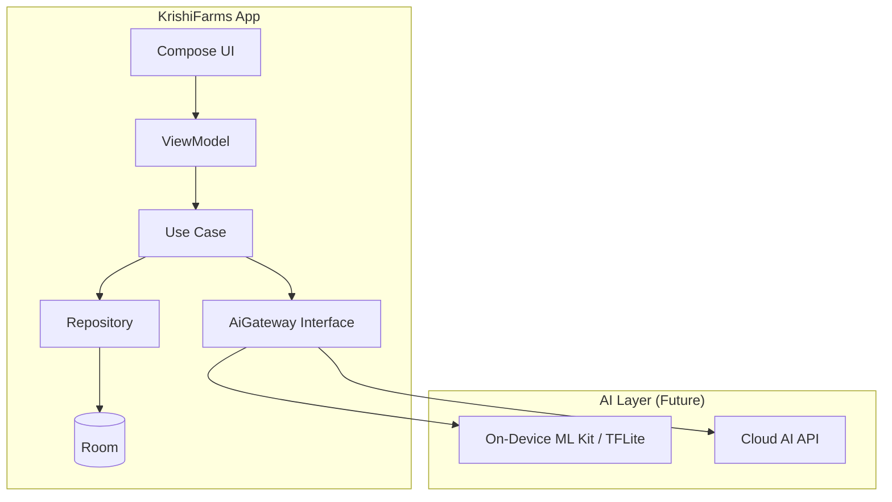

### 11.4 Abstraction: `AiGateway`

Domain interface (not implemented in v1):

| Method | Purpose |
|--------|---------|
| `extractReceiptFields(imagePath)` | OCR pipeline |
| `classifyDocument(imagePath)` | Document type |
| `parseVoiceCommand(audioPath, locale)` | Speech-to-intent |
| `summarizeEntity(entityType, entityId)` | NL summaries |

**Implementation swap:** On-device for offline OCR; cloud for complex Telugu NLU.

### 11.5 Data Preparation for ML

| Practice | Implementation |
|----------|----------------|
| Structured media metadata | `media_uploads` + `documents` with type labels |
| Normalized amounts/dates | Consistent domain types |
| Bilingual text fields | `name` + `nameTe` pairs for training alignment |
| Audit trails | Timestamped actions for behavioral models |
| Export pipeline | Admin CSV/JSON export from Room (future) |

### 11.6 On-Device vs Cloud Decision Matrix

| Feature | On-Device | Cloud |
|---------|-----------|-------|
| Receipt OCR | Preferred (offline) | Fallback |
| Telugu voice | Limited on-device | Cloud preferred |
| Forecasting | — | Cloud |
| Anomaly alerts | — | Cloud (batch) |
| Document classify | TFLite model | Complex docs → cloud |

### 11.7 Privacy-Preserving AI

- On-device inference for PII-containing images by default
- Cloud calls require explicit user consent per request (dialog)
- Redact PII before cloud transmission where possible
- AI audit log: model version, input hash (not raw), output, userId

### 11.8 Push Notifications (Future Phase)

| Component | Role |
|-----------|------|
| FCM | Delivery channel |
| `PushRepository` | Token registration with FastAPI |
| Deep links | Route to work orders, approvals, sync alerts |
| WorkManager | Process data-only messages, trigger pull sync |

Architecture reserves:
- `PushMessageHandler` interface in domain
- `device_tokens` table (Room) + server registration endpoint
- Nav deep link infrastructure (§4.5)

### 11.9 Extensibility Checklist

- [ ] `AiGateway` interface in domain module (no-op impl in v1)
- [ ] Media pipeline accepts plugin processors (`ImageProcessor` chain)
- [ ] Feature flags via DataStore / remote config endpoint
- [ ] Module boundaries allow `:feature:ai-assistant` addition without `:app` changes
- [ ] Event analytics schema versioned for ML feature stores

---

## 12. Appendices

### Appendix A: API Endpoint Summary

| Method | Endpoint | Module |
|--------|----------|--------|
| POST | `/auth/login` | Auth |
| POST | `/auth/refresh` | Auth |
| POST | `/auth/logout` | Auth |
| GET | `/users/me` | Auth |
| GET/POST/PUT/DELETE | `/farmers` | Farmers |
| GET/POST/PUT/DELETE | `/farms` | Farms |
| GET/POST/PUT/DELETE | `/procurements` | Procurement |
| GET/POST/PUT/DELETE | `/farmer-payments` | Farmer Payments |
| GET/POST/PUT/DELETE | `/workers` | Workers |
| GET/POST/PUT/DELETE | `/work-orders` | Work Orders |
| GET/POST/PUT/DELETE | `/attendance` | Attendance |
| GET/POST/PUT/DELETE | `/expenses` | Expenses |
| GET/POST/PUT/DELETE | `/collections` | Collections |
| GET/POST/PUT/DELETE | `/payments` | Payments |
| GET/POST/PUT/DELETE | `/vehicles` | Vehicles |
| GET/POST/PUT/DELETE | `/vehicle-trips` | Trips |
| GET/POST/PUT/DELETE | `/assets` | Assets |
| GET/POST/PUT/DELETE | `/rentals` | Rentals |
| GET/POST/PUT/DELETE | `/documents` | Documents |
| POST | `/media/upload` | Media |
| GET | `/audit/{type}/{id}` | Audit |
| POST | `/sync/push` | Sync |
| GET | `/sync/pull` | Sync |
| GET | `/search` | Search |

### Appendix B: Localization (Telugu + English)

| Concern | Approach |
|---------|----------|
| UI strings | `res/values/strings.xml`, `res/values-te/strings.xml` |
| Compose | `stringResource(R.string.*)` |
| Number/currency | `NumberFormat` + `Locale("te", "IN")` / `Locale.UK` |
| Dates | `java.time` with locale-aware formatting |
| RTL | Not required (LTR scripts) |
| Language toggle | Settings → DataStore `preferred_locale` → activity recreate |
| Search | Telugu input supported; future transliteration for mixed search |
| Server content | Bilingual fields (`name`, `nameTe`) where user-generated |

### Appendix C: Testing Strategy (Reference)

| Layer | Tool |
|-------|------|
| Domain / Use Cases | JUnit 5, Turbine (Flow) |
| Repository | Robolectric + in-memory Room |
| ViewModel | `MainDispatcherRule`, Turbine |
| UI | Compose UI Test |
| Sync | Integration tests with mock web server (MockWebServer) |
| E2E | Manual + future Maestro flows |

### Appendix D: Rollout Phases

| Phase | Scope | Users |
|-------|-------|-------|
| **Phase 1 — MVP** | Auth, Dashboard, Farmers, Farms, Procurement, Documents (camera), Sync | 3–10 |
| **Phase 2 — Finance** | Farmer Payments, Expenses, Collections, Payments | 10–30 |
| **Phase 3 — Operations** | Workers, Work Orders, Attendance | 30–50 |
| **Phase 4 — Fleet** | Vehicles, Trips, Assets, Rentals | 50–100 |
| **Phase 5 — Scale** | Push notifications, FTS search, AI OCR, analytics | 100+ |

### Appendix E: Open Decisions

| Decision | Options | Recommendation |
|----------|---------|----------------|
| SQLCipher | Enable v1 vs v2 | v1 for financial PII |
| Map integration | Google Maps vs Mappls | Defer to Phase 4; design geo fields now |
| Biometric lock | v1 vs v2 | v2 — PIN first |
| Server cursor vs timestamp sync | Cursor | Cursor (handles clock skew) |
| Proto vs Preferences DataStore | Proto | Proto for session/settings schema safety |

---

## Document Control

| Version | Date | Changes |
|---------|------|---------|
| 1.0 | June 2025 | Initial architecture design |

**Next Steps:**
1. Backend team review of sync protocol (§5)
2. Security review of token and encryption approach (§10)
3. UI/UX wireframes aligned to navigation topology (§4)
4. Gradle module scaffolding per §2.3 and §3
5. Room schema prototyping from §6

---

*This document defines the target architecture for KrishiFarms CRM Android. Implementation should follow these boundaries; deviations require architecture review.*
