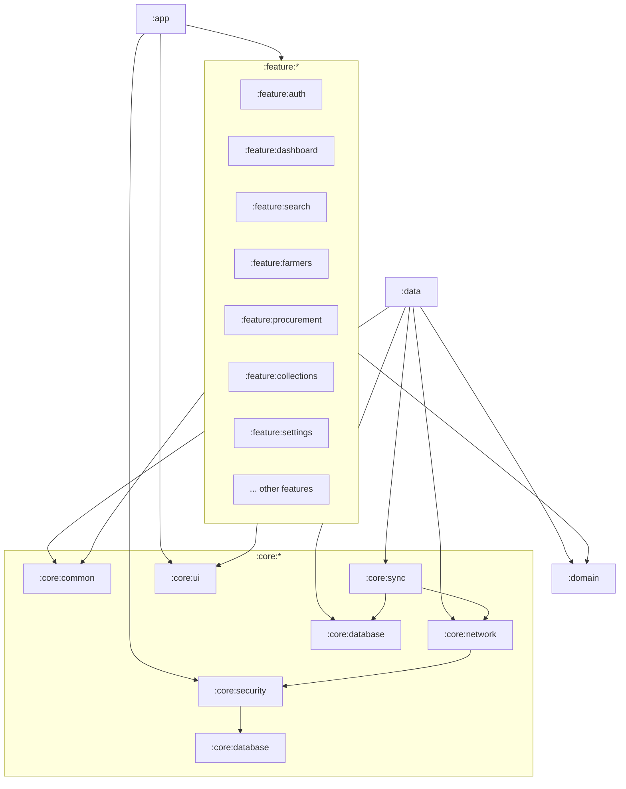
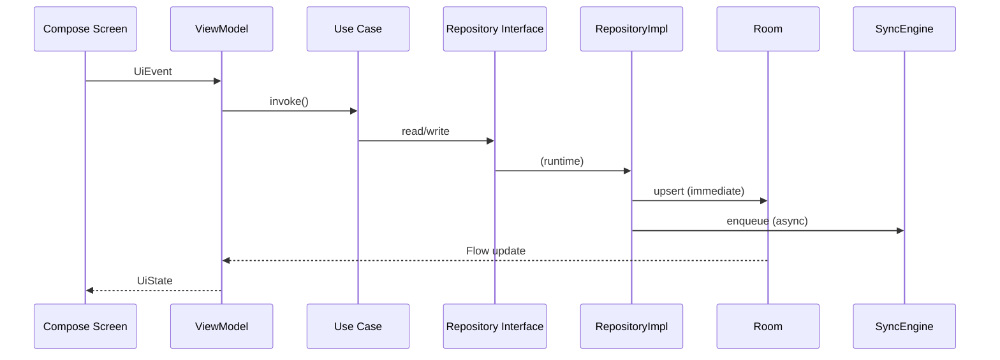
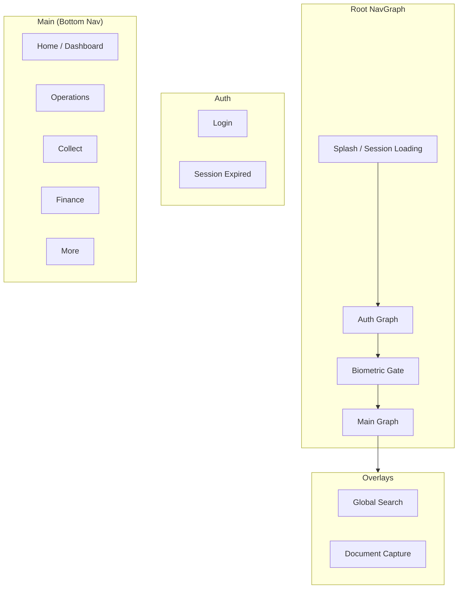
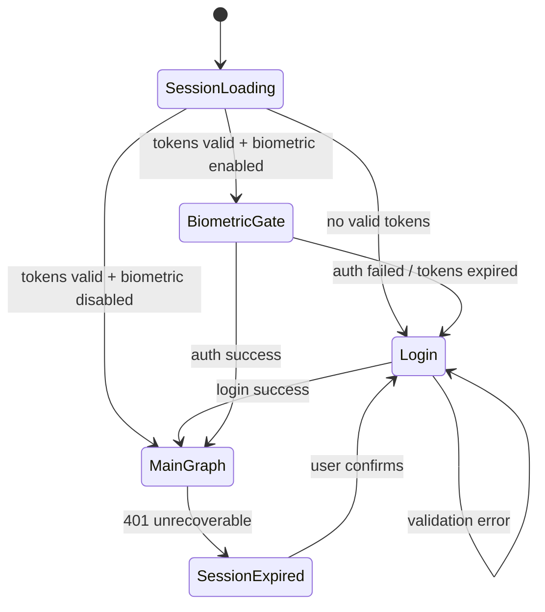
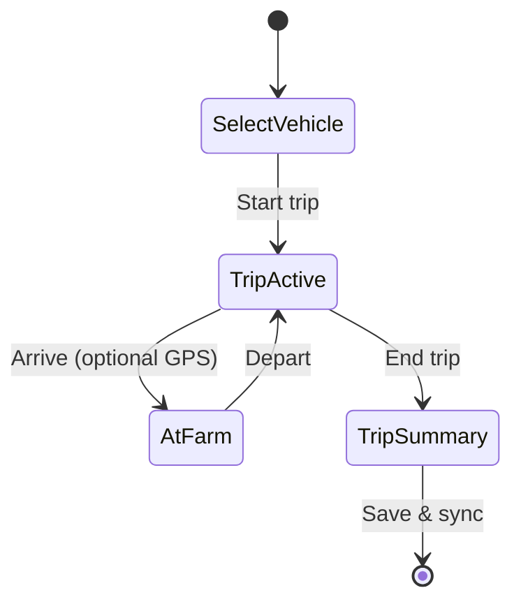
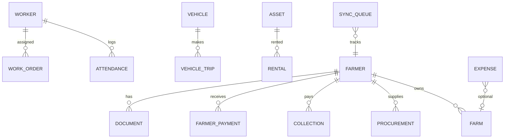
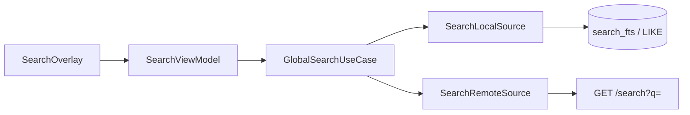
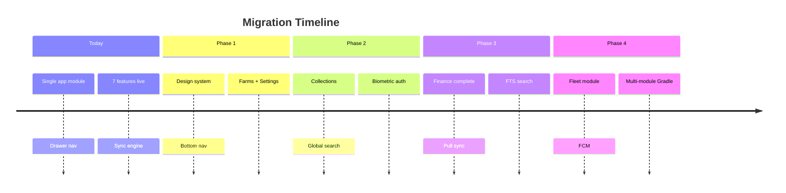

# KrishiFarms Mobile — Product Architecture

**Version:** 1.0  
**Status:** Target State Specification  
**Audience:** Engineering, Product, Design, Security Review  
**Branch baseline:** `initial-commit`  
**Last Updated:** June 2025

> **Canonical product spec.** This document expands and supersedes the single-module MVP scope. It defines the **target production architecture** — navigation, design system, roles, phased rollout, and migration from today's `:app` monolith. For layer-level technical detail see [ARCHITECTURE.md](ARCHITECTURE.md). For sync implementation see [SYNC_ENGINE.md](SYNC_ENGINE.md).

---

## Table of Contents

1. [Executive Summary & Migration Overview](#1-executive-summary--migration-overview)
2. [Complete Project Structure](#2-complete-project-structure)
3. [Modular Architecture](#3-modular-architecture)
4. [Design System](#4-design-system)
5. [Navigation Graph](#5-navigation-graph)
6. [UI Wireframes](#6-ui-wireframes)
7. [State Management Design](#7-state-management-design)
8. [Offline Sync Architecture](#8-offline-sync-architecture)
9. [Database Schema](#9-database-schema)
10. [API Integration Strategy](#10-api-integration-strategy)
11. [Screen-by-Screen Implementation Plan](#11-screen-by-screen-implementation-plan)
12. [User Roles & RBAC](#12-user-roles--rbac)
13. [Rural & Device Optimizations](#13-rural--device-optimizations)
14. [Security: Biometric Auth & Token Migration](#14-security-biometric-auth--token-migration)
15. [Global Search](#15-global-search)
16. [Notifications (FCM — Future)](#16-notifications-fcm--future)
17. [Accessibility & UX Standards](#17-accessibility--ux-standards)
18. [Migration Phases](#18-migration-phases)

---

## 1. Executive Summary & Migration Overview

KrishiFarms Mobile is an **internal Android CRM** for agricultural supply-chain operations in rural Andhra Pradesh and Telangana. The app serves field officers, procurement agents, supervisors, collection agents, and accountants — often on **low-end devices**, **one-handed**, with **intermittent connectivity**.

### Current State (Today — `initial-commit`)

| Aspect | Current |
|--------|---------|
| Gradle | Single `:app` module |
| Package | `com.krishifarms.mobile` |
| Navigation | `ModalNavigationDrawer` + TopAppBar (17 drawer items) |
| Implemented features | Auth, Dashboard, Farmer, Procurement, Worker, Expense, Document + Sync engine |
| Stubs | Farms, Farmer payments, Collections, Payments, Vehicles, Trips, Assets, Rentals, Settings, Sync route |
| Token storage | `EncryptedSharedPreferences` (`TokenStorage.kt`) |
| Preferences | DataStore Preferences for non-token auth prefs |
| Design system | Basic Material 3 theme; no component catalog |
| Search | Per-list local filter only |
| Biometrics | Not implemented |

### Target State (This Document)

| Aspect | Target |
|--------|--------|
| Gradle | Multi-module monorepo (`:app`, `:core:*`, `:domain`, `:data`, `:feature:*`) |
| Navigation | Bottom nav (5 tabs) + hub drill-down + global search overlay |
| Design | Premium Material 3 design system (Linear/Ramp/Stripe/Uber Driver inspired) |
| Auth | Biometric unlock + Proto DataStore token vault |
| Offline | Centralized sync queue (existing) + LWW for operational entities |
| Roles | 5 role personas with tab visibility and action gating |
| Search | Cross-entity global search (local FTS → remote fallback) |
| Notifications | FCM-ready deep link infrastructure (Phase 4+) |

### Design North Stars

| Principle | Implementation |
|-----------|----------------|
| **Offline-first** | Room writes succeed immediately; sync is async |
| **Field-ready** | 48dp touch targets, thumb-zone FABs, high contrast |
| **Premium but practical** | Clean typography, subtle motion, skeleton loading — not decorative chrome |
| **Role-aware** | Navigation and actions filtered by RBAC |
| **Bilingual** | English + Telugu (`strings.xml` / `strings-te.xml`) |

---

## 2. Complete Project Structure

### 2.1 Target Gradle Layout

```
krishifarms-mobile/
├── app/                              # Shell: MainActivity, NavHost, Hilt root, theme wiring
├── build.gradle.kts
├── settings.gradle.kts
├── gradle/
│   └── libs.versions.toml            # Version catalog (single source)
│
├── core/
│   ├── common/                       # Result, dispatchers, IdGenerator, validators
│   ├── network/                      # OkHttp, Retrofit, interceptors, DTOs
│   ├── database/                     # Room DB, entities, DAOs, migrations
│   ├── datastore/                    # Proto DataStore (session, settings, tokens)
│   ├── security/                     # Keystore, biometric gate, RBAC evaluator
│   ├── sync/                         # SyncEngine, handlers, WorkManager workers
│   ├── ui/                           # Design system + shared Compose components
│   └── i18n/                         # Locale helpers, bilingual formatters
│
├── domain/                           # Pure Kotlin: models, repository interfaces, use cases
├── data/                             # Repository implementations, mappers, media pipeline
│
├── feature/
│   ├── auth/
│   ├── dashboard/
│   ├── search/                       # Global search overlay module
│   ├── farmers/
│   ├── farms/
│   ├── procurement/
│   ├── collections/                  # Fast-entry collection flows
│   ├── farmerpayments/
│   ├── workforce/                    # Workers, work orders, attendance
│   ├── expenses/
│   ├── payments/
│   ├── fleet/                        # Vehicles + trips (combined hub)
│   ├── assets/
│   ├── documents/
│   └── settings/
│
├── docs/
│   ├── PRODUCT_ARCHITECTURE.md       # This file
│   ├── ARCHITECTURE.md
│   ├── SYNC_ENGINE.md
│   └── AGENTS.md
│
└── app/schemas/                      # Room schema exports (CI validation)
```

### 2.2 Module Dependency Graph



**Dependency rules (enforced in Gradle):**

| From | May depend on |
|------|---------------|
| `:app` | All feature modules, `:core:ui`, `:core:security` |
| `:feature:*` | `:domain`, `:core:ui`, `:core:common` — **never** `:data` |
| `:data` | `:domain`, `:core:*` |
| `:domain` | `:core:common` only (pure Kotlin) |
| `:core:*` | Other core modules; no feature imports |

### 2.3 Package Naming (Target)

Root: `com.krishifarms.mobile` (retain existing package; do not rename to `com.krishifarms.crm`).

Each Gradle module mirrors package structure:

```
com.krishifarms.mobile.feature.procurement.presentation.list.ProcurementListScreen
com.krishifarms.mobile.core.ui.component.KfPrimaryButton
com.krishifarms.mobile.domain.usecase.farmer.GetFarmersUseCase
```

### 2.4 Current → Target Module Mapping

| Current (`:app` package) | Target Gradle module |
|--------------------------|----------------------|
| `feature/farmer/` | `:feature:farmers` |
| `feature/procurement/` | `:feature:procurement` |
| `feature/worker/` | `:feature:workforce` |
| `feature/expense/` | `:feature:expenses` |
| `feature/document/` | `:feature:documents` |
| `core/sync/` | `:core:sync` |
| `core/database/` | `:core:database` |
| `core/ui/` | `:core:ui` (expanded) |

---

## 3. Modular Architecture

### 3.1 Clean Architecture Per Feature

Every `:feature:*` module follows identical internal layering:

```
feature/<name>/
├── navigation/           # Typed routes, NavGraphBuilder extensions
├── presentation/
│   ├── list/             # Screen, ViewModel, UiState, UiEvent
│   ├── detail/
│   ├── form/
│   └── component/        # Feature-specific composables only
└── di/                   # Hilt module (@Binds repository if feature-local)
```

Shared layers live outside features:

| Layer | Module | Contents |
|-------|--------|----------|
| **Presentation shell** | `:app` | MainActivity, bottom nav scaffold, search overlay host |
| **Domain** | `:domain` | Use cases, domain models, repository interfaces, RBAC policies |
| **Data** | `:data` | Repository impls, mappers, local/remote sources |
| **Infrastructure** | `:core:*` | Room, Retrofit, sync, security, design system |

### 3.2 Feature Module Internal Flow



### 3.3 Cross-Feature Concerns

| Concern | Owner module | Consumption |
|---------|--------------|-------------|
| Design tokens & components | `:core:ui` | All features |
| RBAC checks | `:core:security` + `:domain` policies | ViewModels, navigation |
| Sync handlers | `:core:sync` | Registered per entity type |
| Global search | `:feature:search` + `:domain` `SearchUseCase` | Overlay from app shell |
| Media capture | `:data/media` + `:feature:documents` | Procurement, expenses, documents |

### 3.4 Use Case Catalog (Domain Layer)

| Domain package | Key use cases |
|----------------|---------------|
| `usecase/auth` | `LoginUseCase`, `RefreshSessionUseCase`, `BiometricUnlockUseCase` |
| `usecase/farmer` | `GetFarmersUseCase`, `SaveFarmerUseCase`, `SearchFarmersUseCase` |
| `usecase/procurement` | `CreateProcurementUseCase`, `FastEntryProcurementUseCase` |
| `usecase/collection` | `RecordCollectionUseCase`, `GetDailyCollectionsUseCase` |
| `usecase/fleet` | `StartTripUseCase`, `EndTripUseCase`, `GetActiveTripUseCase` |
| `usecase/sync` | `GetSyncStatusUseCase`, `RetryFailedSyncUseCase`, `ResolveConflictUseCase` |
| `usecase/search` | `GlobalSearchUseCase` |

---

## 4. Design System

### 4.1 Design Philosophy

Inspired by **Linear** (density + clarity), **Ramp** (financial trust), **Stripe** (typography hierarchy), and **Uber Driver** (one-handed field UX):

- **Information density** without clutter — card-based lists, clear numeric emphasis for amounts
- **Trust cues** — sync status, pending badges, confirmation for financial actions
- **Thumb-first** — primary actions in bottom 40% of screen
- **Motion with purpose** — 200ms transitions; skeleton shimmer during load; no decorative animation

### 4.2 Material 3 Theme

| Token | Light | Dark | Notes |
|-------|-------|------|-------|
| Primary | `#1B5E20` (Krishi green) | `#81C784` | Brand anchor |
| Secondary | `#FF8F00` (harvest amber) | `#FFB74D` | CTAs, FABs |
| Surface | `#FAFAFA` | `#121212` | Page background |
| Surface variant | `#F0F4F0` | `#1E1E1E` | Cards |
| Error | `#B00020` | `#CF6679` | Validation, sync failures |
| Outline | `#79747E` @ 40% | `#938F99` @ 40% | Dividers |

**Typography:** Material 3 type scale with **Roboto** (Latin) + **Noto Sans Telugu** for `te` locale.

| Role | Size / Weight | Use |
|------|---------------|-----|
| Display | 32sp / Bold | Dashboard totals |
| Headline | 24sp / SemiBold | Screen titles |
| Title | 18sp / Medium | Card headers |
| Body | 16sp / Regular | Primary content (min readable in sunlight) |
| Label | 14sp / Medium | Buttons, chips |
| Caption | 12sp / Regular | Timestamps, sync meta |

**Shapes:** `medium` = 12dp (cards), `large` = 16dp (bottom sheets), `full` = pills for status chips.

### 4.3 Light / Dark Mode

- Follow system default; override in Settings
- Persist preference in Proto DataStore (`UserPreferences.themeMode`)
- **High contrast mode** toggle for outdoor use (increases text weight, reduces transparency)
- Status bar: transparent with scrim on scroll (edge-to-edge)

### 4.4 Component Catalog (`:core:ui`)

| Component | Name | Spec |
|-----------|------|------|
| Primary button | `KfPrimaryButton` | 48dp min height, full-width on forms |
| Secondary button | `KfSecondaryButton` | Outlined, 48dp |
| FAB | `KfExtendedFab` | Icon + label; bottom-end, 16dp margin |
| Text field | `KfTextField` | 56dp height, clear error state, Telugu IME support |
| Amount field | `KfAmountField` | INR prefix, numeric keyboard, thousand separators |
| Search bar | `KfSearchBar` | Persistent in list screens; opens global search on focus (long press) |
| List row | `KfListRow` | 72dp min height, leading avatar/icon, trailing chevron or sync badge |
| Card | `KfCard` | Elevated 1dp, 12dp radius, optional swipe actions host |
| Status chip | `KfStatusChip` | Synced / Pending / Failed / Offline color coding |
| KPI tile | `KfKpiTile` | Dashboard metric with trend arrow |
| Empty state | `KfEmptyState` | Illustration + title + CTA |
| Error state | `KfErrorState` | Retry action, localized message |
| Skeleton | `KfSkeleton*` | Shimmer placeholders for list, detail, KPI |
| Offline banner | `KfOfflineBanner` | Persistent below top bar when offline |
| Sync indicator | `KfSyncIndicator` | Toolbar chip: pending count + spinner |
| Bottom sheet | `KfBottomSheet` | Confirmations, filters, quick actions |
| Swipe actions | `KfSwipeableRow` | Call, edit, delete (role-gated) |
| Snackbar | `KfSnackbar` | Action slot for Undo / Retry |
| Dialog | `KfConfirmDialog` | Destructive actions require explicit confirm |
| Photo capture | `KfCameraCapture` | CameraX wrapper with compression preview |
| Numeric stepper | `KfQuantityStepper` | Bags, weight — large +/- buttons for one-hand use |

### 4.5 Layout Patterns

| Pattern | Usage |
|---------|-------|
| **List → Detail → Form** | Standard CRUD modules |
| **Fast-entry bottom sheet** | Collection recording, quick procurement |
| **Tabbed detail** | Farmer detail: Info / Farms / Payments / Documents |
| **Hub grid** | Operations, Finance, Fleet sub-hubs (2-column icon grid) |
| **Sticky summary bar** | Running totals during multi-step entry |
| **Pull-to-refresh** | All list screens (triggers sync pull for module) |

---

## 5. Navigation Graph

### 5.1 Topology Overview

Replace drawer with **5-tab bottom navigation** + nested graphs. Global search is a **modal overlay** above the main graph.



### 5.2 Bottom Navigation Tabs

| Tab | Route | Icon | Default roles | Badge |
|-----|-------|------|---------------|-------|
| **Home** | `home` | Dashboard | All | Sync pending |
| **Operations** | `operations` | Agriculture | Field Officer, Supervisor, Procurement Agent | — |
| **Collect** | `collect` | Payments | Collection Agent, Procurement Agent | Today's count |
| **Finance** | `finance` | Receipt | Accountant, Supervisor | Pending approvals |
| **More** | `more` | Menu | All | — |

### 5.3 Hub Sub-Graphs

**Operations Hub** (`operations/`):

| Destination | Route |
|-------------|-------|
| Farmers | `operations/farmers` |
| Farms | `operations/farms` |
| Procurement | `operations/procurement` |
| Workforce | `operations/workforce` |
| Documents | `operations/documents` |

**Collect Hub** (`collect/`):

| Destination | Route |
|-------------|-------|
| Fast entry | `collect/fast-entry` |
| Today's collections | `collect/today` |
| Collection history | `collect/history` |
| Weighment | `collect/weighment` |

**Finance Hub** (`finance/`):

| Destination | Route |
|-------------|-------|
| Farmer payments | `finance/farmer-payments` |
| Expenses | `finance/expenses` |
| Collections (read) | `finance/collections` |
| Outgoing payments | `finance/payments` |

**More Hub** (`more/`):

| Destination | Route |
|-------------|-------|
| Fleet & trips | `more/fleet` |
| Assets & rentals | `more/assets` |
| Settings | `more/settings` |
| Sync status | `more/sync` |
| Profile | `more/profile` |

### 5.4 Auth Flow



### 5.5 Global Search Entry

- **Search icon** in top app bar (all main tabs)
- **Keyboard shortcut:** none (mobile); long-press search bar on list screens
- Route: `search?q={query}` — overlay, `popBackStack` on dismiss
- Does not affect tab back stacks

### 5.6 Deep Links

| URI | Destination | Phase |
|-----|-------------|-------|
| `krishifarms://home` | Dashboard | 2 |
| `krishifarms://farmer/{id}` | Farmer detail | 2 |
| `krishifarms://procurement/create?farmerId=` | Fast procurement | 2 |
| `krishifarms://collect/fast-entry` | Collection fast-entry | 2 |
| `krishifarms://trip/{id}` | Active trip | 4 |
| `krishifarms://sync` | Sync status | 2 |
| `krishifarms://approval/{type}/{id}` | Approval detail | 3 |

Register in `AndroidManifest.xml`; handle in `:app` NavHost with role validation.

### 5.7 Migration: Drawer → Bottom Nav

| Step | Action |
|------|--------|
| 1 | Introduce `MainScaffold` with bottom bar alongside existing drawer (feature flag) |
| 2 | Map `MainFeatureDestinations` to hub sub-routes |
| 3 | Default new users to bottom nav; keep drawer toggle in Settings during transition |
| 4 | Remove drawer after Phase 2 validation |

---

## 6. UI Wireframes

### 6.1 Dashboard (Home Tab)

```
┌─────────────────────────────────────┐
│ ☰  KrishiFarms          🔍  [Sync 2]│
├─────────────────────────────────────┤
│ Good morning, Venkat          te/EN  │
│ ┌─────────┐ ┌─────────┐ ┌─────────┐  │
│ │Farmers  │ │Today    │ │Pending  │  │
│ │  142    │ │Proc ₹2L │ │Sync  2  │  │
│ └─────────┘ └─────────┘ └─────────┘  │
│ Quick Actions                        │
│ [+ Farmer] [+ Procure] [+ Collect]   │
│ Recent Activity                      │
│ ┌─────────────────────────────────┐│
│ │ ● Ram Reddy — Procurement ₹12,400││
│ │ ○ Pending sync — Expense ₹800    ││
│ │ ● Sita Devi — Collection ₹5,000  ││
│ └─────────────────────────────────┘│
├─────────────────────────────────────┤
│ 🏠 Home │ 🌾 Ops │ 💰 Collect │ ... │
└─────────────────────────────────────┘
```

### 6.2 Collection Fast-Entry

```
┌─────────────────────────────────────┐
│ ←  Record Collection                 │
├─────────────────────────────────────┤
│ Farmer  [🔍 Search or scan      ▼]  │
│ ┌─────────────────────────────────┐ │
│ │ Ram Reddy · Mamidipally · 9876… │ │
│ └─────────────────────────────────┘ │
│ Amount (₹)  [________________]       │
│ Mode        (● Cash ○ UPI ○ Bank)   │
│ Notes       [________________]       │
│                                      │
│ ┌─────────────────────────────────┐ │
│ │     💾  SAVE (offline OK)       │ │  ← 56dp primary
│ └─────────────────────────────────┘ │
├─────────────────────────────────────┤
│ Today total: ₹45,200  (12 entries) │
└─────────────────────────────────────┘
```

### 6.3 Farmer Detail (Tabbed)

```
┌─────────────────────────────────────┐
│ ←  Ram Reddy              ✎  📞     │
├─────────────────────────────────────┤
│ [ Info ] [ Farms ] [ Pay ] [ Docs ] │
├─────────────────────────────────────┤
│ Village: Mamidipally                 │
│ Phone:   98765 43210                 │
│ Land:    4.5 acres                   │
│ Crops:   Cotton, Mirchi              │
│ Bank:    ****1234 · SBIN0001234      │
│                                      │
│ ┌─ Sync: ✓ Synced 2h ago ─────────┐ │
│ └─────────────────────────────────┘ │
│                                      │
│         [ + Add Farm ]               │
└─────────────────────────────────────┘
```

### 6.4 Trip Workflow (Fleet — Phase 4)



```
Trip Active Screen:
┌─────────────────────────────────────┐
│ 🚛 TS09 AB 1234 — Active Trip       │
│ Started 09:15 · Driver: Ravi         │
├─────────────────────────────────────┤
│         [  END TRIP  ]               │
│ Stops: Mamidipally → Kurnool depot  │
│ Distance: ~42 km (manual/GPS)       │
└─────────────────────────────────────┘
```

### 6.5 Global Search Overlay

```
┌─────────────────────────────────────┐
│ ←  [🔍  ram________________]  ✕     │
├─────────────────────────────────────┤
│ FARMERS (2)                          │
│   Ram Reddy · Mamidipally            │
│   Rama Rao · Nalgonda                │
│ PROCUREMENT (1)                      │
│   #P-1042 · Ram Reddy · ₹12,400     │
│ DOCUMENTS (1)                        │
│   Aadhaar scan · Ram Reddy           │
└─────────────────────────────────────┘
```

---

## 7. State Management Design

### 7.1 UiState / UiEvent / ViewModel Pattern

Every screen defines:

```kotlin
// Pattern (documentation only — not generated code)
data class FarmerListUiState(
    val farmers: List<FarmerUiModel> = emptyList(),
    val searchQuery: String = "",
    val isLoading: Boolean = true,
    val isRefreshing: Boolean = false,
    val error: UiError? = null,
    val isOffline: Boolean = false,
    val pendingSyncCount: Int = 0,
)

sealed interface FarmerListUiEvent {
    data class SearchQueryChanged(val query: String) : FarmerListUiEvent
    data object Refresh : FarmerListUiEvent
    data class FarmerClicked(val id: String) : FarmerListUiEvent
    data object AddFarmer : FarmerListUiEvent
}
```

### 7.2 ViewModel Contract

| Responsibility | ViewModel | Not ViewModel |
|----------------|-----------|---------------|
| Expose `StateFlow<UiState>` | ✅ | |
| Collect repository `Flow` | ✅ | |
| Map domain → UI models | ✅ | |
| Navigation | Emit one-shot effect | Direct NavController |
| Room / Retrofit calls | ❌ | Use case / repository |
| Context / Resources | ❌ | Pass string IDs in UiError |

### 7.3 Flow Patterns

| Pattern | Usage |
|---------|-------|
| `stateIn(WhileSubscribed(5_000))` | Default for screen state |
| `combine()` | Merge list Flow + sync status + connectivity |
| `flatMapLatest` | Search query debounced → filtered results |
| `PagingData` + `cachedIn(vmScope)` | Large lists (farmers, expenses) |
| `Channel` → `receiveAsFlow()` | One-shot: navigation, snackbar, haptic |

### 7.4 Global App State

| State | Source | Exposure |
|-------|--------|----------|
| Session | `SessionManager` | `StateFlow<SessionState>` |
| Sync | `SyncRepository` | `StateFlow<SyncState>` |
| Connectivity | `NetworkMonitor` | `Flow<Boolean>` |
| Locale | `LocaleManager` | `StateFlow<Locale>` |
| RBAC | `PermissionProvider` | `StateFlow<Set<Permission>>` |
| Active trip | `TripRepository` | `StateFlow<Trip?>` (Phase 4) |

### 7.5 Form State

| Complexity | Approach |
|------------|----------|
| Simple (≤5 fields) | Fields in `UiState` |
| Complex (procurement, expense) | Nested `FormState` in ViewModel |
| Multi-step | Step index in `UiState` + validation per step |
| Draft persistence | Save to Room draft table on `onStop` |

### 7.6 Loading UX

| Phase | UI |
|-------|-----|
| Initial load | Skeleton list (6 rows) |
| Refresh | Pull-to-refresh indicator; keep stale content visible |
| Save | Button loading state + disable form |
| Pagination | Footer skeleton / loading item |

---

## 8. Offline Sync Architecture

> **Aligns with and extends** [SYNC_ENGINE.md](SYNC_ENGINE.md). The centralized `sync_queue` + `SyncHandler` pattern is **retained**. This section adds product-level LWW rules, entity coverage, and target enhancements.

### 8.1 Principles (unchanged)

1. All writes → Room immediately → UI success
2. `OfflineSyncEngine.enqueue()` → `sync_queue`
3. `SyncWorker` processes when `NetworkType.CONNECTED`
4. Idempotency via client UUID + `Idempotency-Key` header

### 8.2 Conflict Strategy by Entity

| Category | Entities | Strategy |
|----------|----------|----------|
| **Financial** | farmer_payments, collections, payments | Server wins; flag for accountant review |
| **Master data** | farmers, farms, workers | Field merge where safe; else server wins |
| **Operational** | attendance, trips, work_orders | **Last Write Wins** (latest `localUpdatedAt`) |
| **Procurement** | procurements | Server wins on amount conflicts |
| **Documents** | documents, media | Immutable after upload; retry only |

### 8.3 Target Entity Handler Registry

| Entity type | Handler | Phase | Notes |
|-------------|---------|-------|-------|
| `FARMER` | `FarmerSyncHandler` | ✅ exists | Full CRUD |
| `PROCUREMENT` | `ProcurementSyncHandler` | ✅ exists | Extend UPDATE |
| `EXPENSE` | `ExpenseSyncHandler` | ✅ exists | |
| `WORKER` | `WorkerSyncHandler` | ✅ exists | Includes work orders, attendance |
| `DOCUMENT` | `DocumentSyncHandler` | ✅ exists | + `DocumentUploadWorker` |
| `FARM` | `FarmSyncHandler` | 1 | New |
| `COLLECTION` | `CollectionSyncHandler` | 2 | Fast-entry priority queue |
| `FARMER_PAYMENT` | `FarmerPaymentSyncHandler` | 2 | |
| `PAYMENT` | `PaymentSyncHandler` | 3 | |
| `VEHICLE` | `VehicleSyncHandler` | 4 | |
| `TRIP` | `TripSyncHandler` | 4 | LWW |
| `ASSET` | `AssetSyncHandler` | 4 | |
| `RENTAL` | `RentalSyncHandler` | 4 | |

### 8.4 Priority Queue Enhancements

| Priority | Operations |
|----------|------------|
| CRITICAL (100) | Auth refresh, conflict resolution ack |
| HIGH (50) | Collection create, procurement create |
| NORMAL (0) | Updates, master data |
| LOW (-50) | Audit flush, analytics |

Collection and procurement enqueue with `priority = 50` for same-day field relevance.

### 8.5 Pull Sync (Target)

Current: push-only via handlers. Target adds:

1. `SyncPullWorker` after successful push
2. `GET /sync/pull?cursor=&modules=` → merge into Room
3. Per-module `sync_metadata.lastSyncTimestamp` (exists) drives incremental pull

### 8.6 Sync UX Surfaces

| Surface | Component |
|---------|-----------|
| Top bar | `KfSyncIndicator` — pending count |
| Home tab badge | Pending total |
| More → Sync | Full queue debug (existing `SyncDebugScreen`) |
| Entity rows | `KfStatusChip` — pending/failed |
| Offline | `KfOfflineBanner` |

---

## 9. Database Schema

Single Room database: `krishifarms_crm.db`. Current version: **4**. Target version increments with each phase.

### 9.1 Sync Infrastructure (Existing)

| Table | Purpose |
|-------|---------|
| `sync_queue` | Pending operations (`SyncOperationEntity`) |
| `sync_metadata` | Per-entity-type last sync timestamp |
| `sync_conflicts` | Manual conflict review queue |

Embedded on all syncable entities:

```
SyncMetadata: syncStatus, lastSyncedAt, localUpdatedAt, syncError, isDeleted
```

### 9.2 Implemented Entities (Today)

| Table | Status | Key fields |
|-------|--------|------------|
| `farmers` | ✅ | id, serverId, name, village, phone, bankDetails, landAcres, cropTypes |
| `farms` | ✅ schema | id, farmerId, name, acreage, cropType, lat/lng |
| `procurements` | ✅ | farmerId, crop, bags, weight, moisture, rate, netAmount, attachments |
| `expenses` | ✅ | category, amount, expenseDate, vendor, paymentMethod, bill paths |
| `workers` | ✅ | name, phone, defaultHourlyRate, active |
| `work_orders` | ✅ | workerId, farmId, activityType, duration, cost |
| `attendance` | ✅ | workerId, date, checkIn, checkOut, status |
| `documents` | ✅ | documentType, localPath, remoteUrl, linkedEntity |
| `payments` | ✅ schema | farmerId, amount, paymentMode, paidAt |

### 9.3 Target Entities (To Add)

#### `collections`

| Column | Type | Notes |
|--------|------|-------|
| id | TEXT PK | Client UUID |
| server_id | TEXT | Nullable |
| farmer_id | TEXT FK | → farmers |
| amount | REAL | INR |
| collection_date | INTEGER | Epoch ms |
| mode | TEXT | CASH, UPI, BANK |
| reference_no | TEXT | Nullable |
| notes | TEXT | |
| recorded_by | TEXT | User ID |
| + SyncMetadata | | |

Index: `(collection_date)`, `(farmer_id)`, `(sync_sync_status)`

#### `farmer_payments`

| Column | Type | Notes |
|--------|------|-------|
| id | TEXT PK | |
| farmer_id | TEXT FK | |
| procurement_id | TEXT FK | Nullable |
| amount | REAL | |
| payment_mode | TEXT | |
| reference_no | TEXT | |
| paid_at | INTEGER | |
| status | TEXT | PENDING, APPROVED, REJECTED |
| approved_by | TEXT | Nullable |
| + SyncMetadata | | |

#### `vehicles`

| Column | Type | Notes |
|--------|------|-------|
| id | TEXT PK | |
| registration_no | TEXT UNIQUE | |
| type | TEXT | TRUCK, TRACTOR, OTHER |
| capacity_kg | REAL | Nullable |
| status | TEXT | ACTIVE, MAINTENANCE, RETIRED |
| + SyncMetadata | | |

#### `vehicle_trips`

| Column | Type | Notes |
|--------|------|-------|
| id | TEXT PK | |
| vehicle_id | TEXT FK | |
| driver_name | TEXT | |
| start_time | INTEGER | |
| end_time | INTEGER | Nullable |
| start_location | TEXT | |
| end_location | TEXT | Nullable |
| distance_km | REAL | |
| purpose | TEXT | |
| status | TEXT | ACTIVE, COMPLETED, CANCELLED |
| + SyncMetadata | | LWW |

#### `assets` / `rentals`

Per [ARCHITECTURE.md §6.3](ARCHITECTURE.md#63-core-tables) — implement in Phase 4.

#### `users` (cached session)

| Column | Type | Notes |
|--------|------|-------|
| id | TEXT PK | |
| display_name | TEXT | |
| mobile | TEXT | |
| role | TEXT | FIELD_OFFICER, PROCUREMENT_AGENT, etc. |
| permissions_json | TEXT | |
| last_login_at | INTEGER | |

#### `search_fts` (Phase 3)

Room FTS4 virtual table spanning farmer name, phone, village, procurement IDs — rebuilt on entity change via trigger or repository hook.

#### `device_tokens` (Phase 4 — FCM)

| Column | Type |
|--------|------|
| token | TEXT PK |
| registered_at | INTEGER |
| server_registered | INTEGER (bool) |

### 9.4 ER Diagram (Target)



---

## 10. API Integration Strategy

### 10.1 Stack

| Component | Technology |
|-----------|------------|
| HTTP client | OkHttp 4.x |
| REST | Retrofit 2.x |
| Serialization | Kotlinx Serialization (`@SerialName` snake_case) |
| Auth | JWT Bearer + refresh via `Authenticator` |
| Base URL | `BuildConfig.API_BASE_URL` (`/api/v1/`) |

### 10.2 Interceptor Chain

```
Request → ConnectivityCheck → AuthInterceptor (Bearer)
        → IdempotencyInterceptor (mutations)
        → LoggingInterceptor (debug only)
        → CertificatePinner (release)
Response → TokenAuthenticator (401 → refresh → retry once)
```

### 10.3 JWT Lifecycle

| Event | Action |
|-------|--------|
| Login | `POST /auth/login` → store tokens in Proto DataStore |
| Each request | Attach `Authorization: Bearer {access}` |
| 401 | `POST /auth/refresh` → update access token → retry |
| Refresh fail | Clear session → navigate to login |
| Logout | `POST /auth/logout` → clear tokens + cancel workers |

### 10.4 Pagination

| Pattern | Usage |
|---------|-------|
| Offset (`page`, `size`) | Initial full sync, admin exports |
| Cursor (`cursor`, `limit`) | Incremental pull sync |
| Local | Room `PagingSource` + optional `RemoteMediator` |

Standard list endpoint:

```
GET /farmers?page=1&size=20&search=ram&sort=name,asc
```

Response envelope:

```json
{
  "items": [...],
  "page": 1,
  "size": 20,
  "total": 142,
  "next_cursor": "eyJ..."
}
```

### 10.5 Multipart Upload

```
POST /media/upload
Content-Type: multipart/form-data

file: (binary)
entity_type: PROCUREMENT
entity_id: local_uuid
document_type: WEIGHMENT_SLIP
```

- Compress images via `ImageCompressor` before upload (max 1920px, JPEG 85%)
- `DocumentUploadWorker` handles retry independently of sync queue
- Link `remote_url` back to entity on success

### 10.6 Idempotency

| Layer | Mechanism |
|-------|-----------|
| Client ID | `local_{uuid}` as entity primary key |
| Queue | `idempotency_key` column dedup |
| HTTP | `Idempotency-Key: {key}` header on POST |
| Server | Return 200 with existing resource on duplicate |

### 10.7 Error Handling

Use `safeApiCall` wrapper → `AppResult<T>` → map to `UiError` in ViewModel. See [ARCHITECTURE.md §9](ARCHITECTURE.md#9-error-handling-strategy).

---

## 11. Screen-by-Screen Implementation Plan

### 11.1 Phase Overview

| Phase | Theme | Modules | User count |
|-------|-------|---------|------------|
| **Phase 1** | Foundation + core field ops | Design system, bottom nav, farms, settings | 3–10 |
| **Phase 2** | Collections + finance entry | Collections fast-entry, farmer payments, global search | 10–30 |
| **Phase 3** | Finance completion + approvals | Outgoing payments, expense approvals, FTS search | 30–50 |
| **Phase 4** | Fleet + scale | Vehicles, trips, assets, FCM, multi-module Gradle | 50–100 |

### 11.2 Phase 1 — Foundation (Priority P0)

| Screen | Route | Priority | Depends on |
|--------|-------|----------|------------|
| Design system components | — | P0 | — |
| Bottom nav shell | `home`, `operations`, etc. | P0 | Design system |
| Biometric gate | `biometric` | P1 | Token migration |
| Settings | `more/settings` | P0 | — |
| Profile | `more/profile` | P1 | Settings |
| Language toggle | Settings sub | P0 | DataStore |
| Sync status | `more/sync` | P0 | Wire `SyncDebugScreen` |
| Farms list | `operations/farms` | P0 | Farm entity (exists) |
| Farm detail | `operations/farms/{id}` | P0 | Farms list |
| Farm form | `operations/farms/create` | P0 | Farmer picker |
| Dashboard refresh | `home` | P1 | Bottom nav |
| Token → Proto DataStore | — | P1 | Security module |

### 11.3 Phase 2 — Collections & Finance Entry (P0–P1)

| Screen | Route | Priority |
|--------|-------|----------|
| Collection fast-entry | `collect/fast-entry` | P0 |
| Today's collections | `collect/today` | P0 |
| Collection history | `collect/history` | P1 |
| Collection detail | `collect/{id}` | P1 |
| Farmer payments list | `finance/farmer-payments` | P1 |
| Farmer payment form | `finance/farmer-payments/create` | P1 |
| Global search overlay | `search` | P1 |
| Farmer detail tabs | `operations/farmers/{id}` | P1 |
| Deep links (core set) | — | P2 |

### 11.4 Phase 3 — Finance Completion (P1–P2)

| Screen | Route | Priority |
|--------|-------|----------|
| Outgoing payments list | `finance/payments` | P1 |
| Payment form | `finance/payments/create` | P1 |
| Expense approval flow | `finance/expenses/{id}/approve` | P2 |
| Farmer payment approval | `finance/farmer-payments/{id}/approve` | P2 |
| Conflict resolution UI | `more/sync/conflicts` | P2 |
| FTS search upgrade | `search` | P2 |
| Pull sync worker | — | P2 |

### 11.5 Phase 4 — Fleet & Scale (P2–P3)

| Screen | Route | Priority |
|--------|-------|----------|
| Vehicle list | `more/fleet/vehicles` | P2 |
| Trip list + active trip | `more/fleet/trips` | P2 |
| Start/end trip flow | `more/fleet/trips/active` | P2 |
| Asset list / detail | `more/assets` | P3 |
| Rental management | `more/assets/rentals` | P3 |
| FCM registration | — | P3 |
| Push deep links | — | P3 |
| Gradle multi-module split | — | P2 |
| SQLCipher encryption | — | P3 |

---

## 12. User Roles & RBAC

### 12.1 Role Definitions

| Role | Code | Primary tasks |
|------|------|---------------|
| **Field Officer** | `FIELD_OFFICER` | Farmer/farm registration, document capture, read procurement |
| **Procurement Agent** | `PROCUREMENT_AGENT` | Weighment, procurement create, farmer lookup |
| **Farm Supervisor** | `SUPERVISOR` | Workforce, work orders, attendance, expense create, approvals |
| **Collection Agent** | `COLLECTION_AGENT` | Daily collections, fast-entry, farmer lookup |
| **Accountant** | `ACCOUNTANT` | All finance modules, approvals, read-only ops |

`ADMIN` inherits all permissions (future web admin; not primary mobile persona).

### 12.2 Tab Visibility Matrix

| Tab | Field Officer | Procurement Agent | Supervisor | Collection Agent | Accountant |
|-----|:-------------:|:-----------------:|:----------:|:----------------:|:----------:|
| Home | ✅ | ✅ | ✅ | ✅ | ✅ |
| Operations | ✅ | ✅ | ✅ | ❌ | 👁 |
| Collect | ❌ | 👁 | 👁 | ✅ | 👁 |
| Finance | ❌ | ❌ | ✅ | ❌ | ✅ |
| More | ✅ | ✅ | ✅ | ✅ | ✅ |

👁 = read-only hub access where applicable

### 12.3 Action Permissions (Sample)

| Action | Roles |
|--------|-------|
| Create farmer | Field Officer, Supervisor, Procurement Agent |
| Create procurement | Procurement Agent, Supervisor |
| Record collection | Collection Agent, Supervisor |
| Approve payment | Accountant, Supervisor |
| Manage workforce | Supervisor |
| Start trip | Field Officer, Supervisor, Procurement Agent |
| Export audit | Accountant, Admin |

Enforcement: `PermissionProvider.can()` in ViewModel → hide/disable UI; use case guard as backup; server authoritative.

---

## 13. Rural & Device Optimizations

### 13.1 Connectivity

| Scenario | Behavior |
|----------|----------|
| Offline | All reads from Room; writes queue; banner visible |
| 2G / slow | Smaller image uploads; extend timeouts; show "syncing slowly" |
| Reconnect | Expedited `SyncWorker` via `SyncReconnectCoordinator` (exists) |
| Airplane mode | No crash; queue depth in badge |

### 13.2 Low-End Devices (2GB RAM, API 26+)

| Optimization | Implementation |
|--------------|----------------|
| Image compression | Max 1920px before save/upload |
| List performance | `Paging 3`, stable keys, avoid heavy images in rows |
| Memory | Coil size limits; clear camera staging after upload |
| Startup | Lazy Hilt providers; defer non-critical workers |
| DB | Index only queried columns; prune old sync_queue SUCCESS rows |
| APK size | R8 shrink; vector icons; no unused ML libs until Phase 4+ |

### 13.3 One-Handed Use

| Pattern | Spec |
|---------|------|
| Primary actions | Bottom 40% of screen |
| FAB / extended FAB | Bottom-end, 16dp from nav bar |
| Bottom sheets | For confirmations and fast-entry |
| Top actions | Secondary only (edit, overflow) |
| Numeric entry | Large stepper buttons (48dp) for bags/weight |

### 13.4 Outdoor / Rural UX

| Concern | Mitigation |
|---------|------------|
| Sunlight readability | High contrast mode; min 16sp body; bold amounts |
| Dust / wet hands | Large touch targets (48dp min); swipe tolerance |
| Telugu input | Noto Sans Telugu; IME configured per field |
| Literacy variance | Icon + text labels; numeric emphasis over prose |

---

## 14. Security: Biometric Auth & Token Migration

### 14.1 Current Implementation

- Tokens in `EncryptedSharedPreferences` via `EncryptedTokenStorage`
- Auth preferences in DataStore Preferences (`AuthPreferences.kt`)

### 14.2 Target Implementation

| Asset | Storage |
|-------|---------|
| Access token | Proto DataStore `SessionProto` (encrypted via `EncryptedFile` + Keystore) |
| Refresh token | Hardware-backed Keystore wrapper + Proto DataStore |
| Biometric preference | Proto DataStore `UserPreferences.biometricEnabled` |
| User profile cache | Room `users` table |

### 14.3 Biometric Gate Flow

1. After login, offer "Enable fingerprint unlock" in Settings
2. On cold start with valid tokens + biometric enabled → `BiometricPrompt` before MainGraph
3. Failed biometric (3 attempts) → fall back to login
4. Background timeout (30 min) → require biometric or PIN (Phase 3)

Use `androidx.biometric:biometric` with `BIOMETRIC_STRONG` preferred.

### 14.4 Migration Path: EncryptedSharedPreferences → DataStore

| Step | Action |
|------|--------|
| 1 | Define `session.proto` schema (access_token, refresh_token, expires_at) |
| 2 | Implement `ProtoTokenStorage` implementing existing `TokenStorage` interface |
| 3 | On first launch after update: read legacy `EncryptedSharedPreferences` → write Proto → clear legacy |
| 4 | Feature flag `use_proto_tokens` during rollout |
| 5 | Remove `EncryptedTokenStorage` after migration confirmed |

**No user action required** — silent migration on upgrade.

---

## 15. Global Search

### 15.1 Architecture



### 15.2 Search Behavior

| State | Source |
|-------|--------|
| Offline | Local only (FTS/LIKE) |
| Online | Local first (instant) → remote enrich (debounced 300ms) |
| Empty query | Recent searches + pinned farmers |
| Result tap | Navigate to detail; dismiss overlay |

### 15.3 Indexed Fields

| Entity | Fields |
|--------|--------|
| Farmers | name, phone, village, nameTe |
| Farms | name, cropType |
| Procurements | id, farmer name, crop, village |
| Collections | farmer name, amount, date |
| Documents | fileName, documentType, linked entity |
| Workers | name, phone |

### 15.4 UI

- Full-screen overlay with `KfSearchBar` autofocus
- Grouped results by entity type with "See all" per group
- Highlight matched substring
- Telugu query supported; transliteration deferred to Phase 3 FTS upgrade

---

## 16. Notifications (FCM — Future)

### 16.1 Phase 4 Scope

| Component | Module |
|-----------|--------|
| `FirebaseMessagingService` | `:app` |
| `PushRepository` | `:data` |
| `device_tokens` Room table | `:core:database` |
| `POST /devices/register` | API |
| Deep link routing | `:app` NavHost |

### 16.2 Notification Types

| Type | Deep link | Roles |
|------|-----------|-------|
| Payment approval needed | `krishifarms://approval/payment/{id}` | Accountant |
| Sync conflict | `krishifarms://sync` | All |
| Work order assigned | `krishifarms://workorder/{id}` | Supervisor |
| Trip reminder | `krishifarms://trip/{id}` | Field Officer |

### 16.3 Data-Only Messages

Prefer data payloads processed by `PushWorker` → trigger pull sync — avoids stale notification content offline.

---

## 17. Accessibility & UX Standards

### 17.1 Accessibility (WCAG-oriented)

| Requirement | Implementation |
|-------------|----------------|
| Touch targets | Min 48×48dp |
| Color contrast | 4.5:1 body text; do not rely on color alone for sync status |
| Content descriptions | All icons in bottom nav, FABs, swipe actions |
| Screen reader | Semantic headings; list item summaries ("Ram Reddy, farmer, pending sync") |
| Font scaling | Support system font scale to 1.3× without layout break |
| Focus order | Logical top → bottom on forms |

### 17.2 UX Patterns (Required)

| Pattern | Where |
|---------|-------|
| Bottom navigation | Primary module access |
| Large touch targets | All tappable elements |
| Swipe actions | List rows: call farmer, edit, delete (role-gated) |
| Skeleton loading | All list and detail initial loads |
| Pull-to-refresh | All lists |
| Offline banner | App shell when disconnected |
| Haptic feedback | Save success, destructive confirm |
| Undo snackbar | Delete actions (5s window, local only until sync) |

---

## 18. Migration Phases

### 18.1 Documentation & Design (Now)

- [x] Product architecture spec (this document)
- [ ] Figma / component specs aligned to §4 (design team)
- [ ] Backend sync pull endpoint contract

### 18.2 Phase 1 — Shell & Core Ops (Weeks 1–4)

**Goal:** Replace drawer with bottom nav; ship farms + settings; establish design system.

| Work item | Type |
|-----------|------|
| `:core:ui` component catalog | Code |
| Bottom nav `MainScaffold` | Code |
| Settings + profile + language | Code |
| Wire sync debug route | Code |
| Farms feature (list/detail/form) | Code |
| Token storage migration plan | Code |
| Update AGENTS.md module table | Docs |

**Exit criteria:** Field officers manage farms; settings usable; bottom nav default.

### 18.3 Phase 2 — Collections & Search (Weeks 5–8)

**Goal:** Collection agents record payments offline; finance visibility.

| Work item | Type |
|-----------|------|
| `collections` entity + handler | Code |
| Collect tab + fast-entry screen | Code |
| Farmer payments list/create | Code |
| Global search overlay (local) | Code |
| Farmer detail tabs | Code |
| Deep links (farmer, collect) | Code |
| Biometric gate | Code |

**Exit criteria:** Collection agent completes 20+ offline entries syncing correctly.

### 18.4 Phase 3 — Finance & Polish (Weeks 9–12)

**Goal:** Accountant workflows; approvals; production hardening.

| Work item | Type |
|-----------|------|
| Outgoing payments module | Code |
| Approval flows | Code |
| Pull sync worker | Code |
| FTS search | Code |
| Conflict resolution UI | Code |
| High contrast mode | Code |
| Remove drawer navigation | Code |

**Exit criteria:** End-to-end procurement → payment → collection reconciled.

### 18.5 Phase 4 — Fleet & Scale (Weeks 13–16+)

**Goal:** Logistics; Gradle split; push notifications.

| Work item | Type |
|-----------|------|
| Vehicles + trips module | Code |
| Assets + rentals | Code |
| Gradle multi-module extraction | Code |
| FCM + deep links | Code |
| SQLCipher | Code |
| Performance profiling on 2GB device | QA |

**Exit criteria:** 100-user load test; modular build < 3 min clean.

### 18.6 Current vs Target Summary



---

## Related Documents

| Document | Relationship |
|----------|--------------|
| [ARCHITECTURE.md](ARCHITECTURE.md) | Layer boundaries, security detail, AI readiness |
| [SYNC_ENGINE.md](SYNC_ENGINE.md) | Sync queue implementation reference |
| [AGENTS.md](AGENTS.md) | Agent onboarding, module status, coding patterns |
| [README.md](../README.md) | Build instructions, quick reference |

---

## Document Control

| Version | Date | Changes |
|---------|------|---------|
| 1.0 | June 2025 | Initial product architecture — target state for expanded CRM |

**Next steps:**
1. Design review of component catalog (§4)
2. Backend alignment on collections API + pull sync
3. Phase 1 sprint planning from §11.2
4. Execute Gradle module split plan (§2) in Phase 4

---

*This document defines the product and production architecture target for KrishiFarms Mobile. Implementation PRs should reference the relevant phase and section. Deviations require architecture review.*
