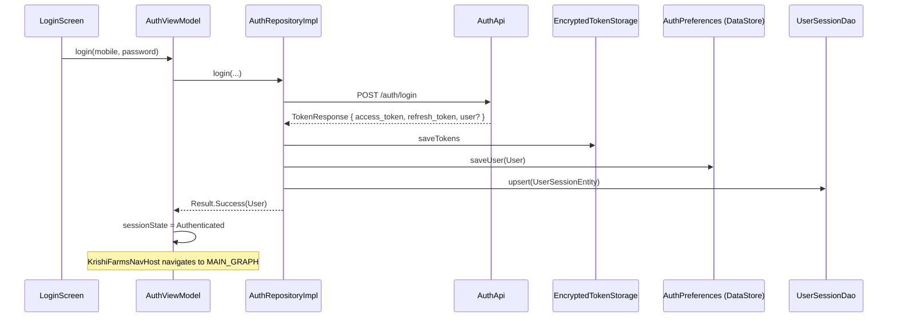
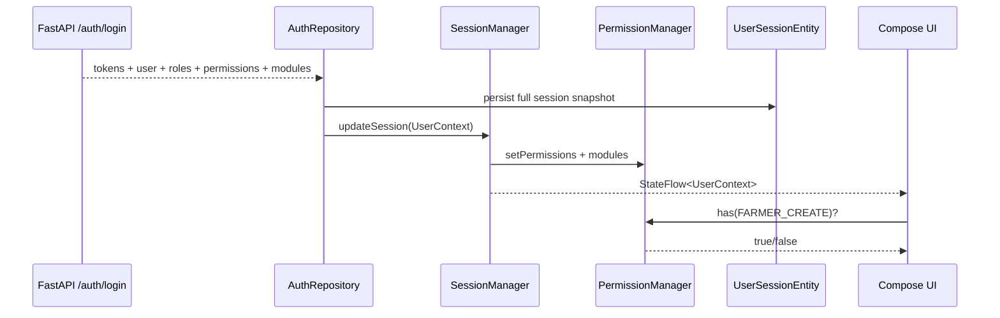
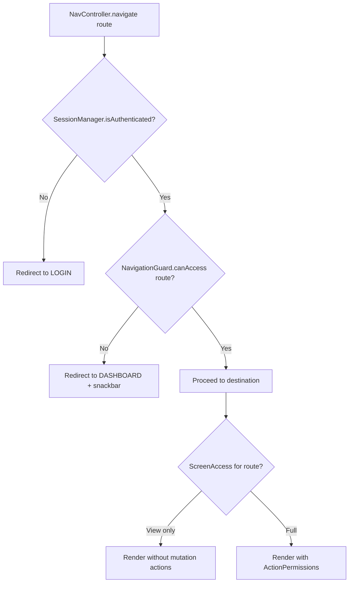
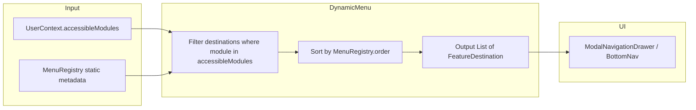

# KrishiFarms Mobile — RBAC Implementation Plan

**Version:** 1.0  
**Status:** Implementation Plan (pre-code)  
**Branch baseline:** `feature/ui-changes`  
**Audience:** Android engineering, backend API team, security review  
**Last Updated:** June 2025

> **Scope:** Convert KrishiFarms Mobile from an open drawer CRM (all modules visible to every authenticated user) to a **permission-driven enterprise app**. Authorization decisions must be based on **server-provided permissions and accessible modules**, not hardcoded `role → screen` maps in the client.

**Related docs:** [AGENTS.md](AGENTS.md) · [ARCHITECTURE.md](ARCHITECTURE.md) §10.5 · [PRODUCT_ARCHITECTURE.md](PRODUCT_ARCHITECTURE.md) §12

---

## Table of Contents

1. [Current State Analysis](#1-current-state-analysis)
2. [Gap Analysis](#2-gap-analysis)
3. [Refactoring Strategy](#3-refactoring-strategy)
4. [Updated Package Structure](#4-updated-package-structure)
5. [New Components Required](#5-new-components-required)
6. [Files To Modify](#6-files-to-modify)
7. [Step By Step Migration Plan](#7-step-by-step-migration-plan)
8. [Risks](#8-risks)
9. [Recommended Implementation Sequence](#9-recommended-implementation-sequence)

---

## 1. Current State Analysis

### 1.1 Authentication Flow (Today)



**Key files:**

| Layer | File | Behavior |
|-------|------|----------|
| UI | `feature/auth/presentation/login/LoginScreen.kt` | Mobile + password form; no role display |
| VM | `feature/auth/presentation/AuthViewModel.kt` | `SessionState`: Loading / Authenticated / Unauthenticated only |
| Repo | `feature/auth/data/repository/AuthRepositoryImpl.kt` | Persists tokens + minimal user; fallback user if `user` null |
| API | `feature/auth/data/remote/AuthApi.kt` | `login`, `refreshToken`, `logout` |
| DTO | `feature/auth/data/dto/AuthDtos.kt` | `LoginResponse` / `TokenResponse` with optional `UserDto` |
| Tokens | `feature/auth/data/local/TokenStorage.kt` | `EncryptedSharedPreferences` |
| Prefs | `feature/auth/data/local/AuthPreferences.kt` | Serializes `UserDto` JSON to DataStore |
| Room | `core/data/local/entity/UserSessionEntity.kt` | `userId`, `name`, `mobile`, `email`, `role`, `lastLoginAt` |

**Session gate:** `KrishiFarmsNavHost` observes `AuthViewModel.sessionState` and routes to `SESSION_LOADING` → `LOGIN` or `MAIN_GRAPH`. There is **no permission hydration step** and **no forbidden-route handling**.

**Token refresh:** `TokenRefreshManager` refreshes JWT only; refreshed `TokenResponse.user` is optionally persisted but still lacks permissions.

**Duplicate DTO hazard:** `core/network/dto/Dtos.kt` defines a separate `AuthDtos.UserDto` (`phone`, required `role`, `region`) used by `ApiServices.getCurrentUser()` — **not wired into login flow** and inconsistent with `feature/auth/data/dto/UserDto` (`mobile`, optional `role`).

### 1.2 User Model (Today)

**Domain (`feature/auth/domain/model/User.kt`):**

```kotlin
data class User(
    val id: String,
    val name: String,
    val mobile: String,
    val email: String?,
    val role: String?,   // single optional string — not a list
)
```

**Missing from model:** `roles: List<String>`, `permissions: Set<String>`, `accessibleModules: Set<String>`.

**Persistence:**

| Store | Fields stored | Permissions |
|-------|---------------|-------------|
| DataStore (`AuthPreferences`) | Serialized `UserDto` | ❌ |
| Room (`user_sessions`) | `role: String?` | ❌ |
| Encrypted prefs | JWT only | ❌ |

`ARCHITECTURE.md` §6.3 describes a target `users` table with `permissions TEXT (JSON array)` — **not implemented**.

### 1.3 Navigation (Today)

**Root graph (`KrishiFarmsNavHost.kt`):**

| Route | Purpose |
|-------|---------|
| `session_loading` | Spinner while restoring session |
| `login` | `LoginScreen` |
| `main_graph` | `MainNavGraph` (drawer shell) |

**Main graph (`MainNavGraph.kt`):** `ModalNavigationDrawer` with **17 feature destinations + Sync** — all items rendered unconditionally via `MainFeatureDestinations + SyncDestination`. No filtering by role or permission.

**Start destination:** `Routes.DASHBOARD`.

**Feature wiring:**

| Nav extension | Routes registered |
|---------------|-------------------|
| `farmerGraph()` | `farmers`, `farmers/{id}`, `farmers/add`, `farmers/{id}/edit` |
| `workerRoutes()` | `workers`, `workers/{id}`, `workers/form`, `workers/form/{id}`, `attendance`, `work_orders`, `work_orders/form`, `work_orders/{id}` |
| `documentRoutes()` | `document/upload`, `document/capture`, `document/preview/{id}`, `document/list` |
| Inline composables | procurement, expense, dashboard, stubs |

**No route-level guards:** Deep navigation (e.g. direct `farmers/add`) is reachable if the user knows the route string.

### 1.4 Complete Screen Inventory

#### 1.4.1 Wired Screens (Implemented UI)

| Module | Screen | Route(s) | Primary actions (today) | Permission gates needed |
|--------|--------|----------|-------------------------|-------------------------|
| **Auth** | Session loading | `session_loading` | — | — |
| **Auth** | Login | `login` | Submit login, remember me | — |
| **Dashboard** | Dashboard | `dashboard` | Pull-to-refresh; tap 7 KPI cards → navigate | Card visibility per module permission |
| **Farmer** | List | `farmers` | Search, refresh, **FAB add**, row tap → detail | `FARMER_VIEW`, `FARMER_CREATE` |
| **Farmer** | Detail | `farmers/{farmerId}` | **Edit** icon → form | `FARMER_VIEW`, `FARMER_UPDATE` |
| **Farmer** | Form (add/edit) | `farmers/add`, `farmers/{id}/edit` | Save farmer | `FARMER_CREATE` / `FARMER_UPDATE` |
| **Procurement** | List | `procurement`, `procurement/list` | Refresh, **FAB create**, row tap | `PROCUREMENT_VIEW`, `PROCUREMENT_CREATE` |
| **Procurement** | Detail | `procurement/{id}` | View only (read-only) | `PROCUREMENT_VIEW` |
| **Procurement** | Form | `procurement/create` | Save, camera attachment | `PROCUREMENT_CREATE`, `DOCUMENT_CREATE` |
| **Worker** | List | `workers` | **FAB add**, attendance shortcut, work orders shortcut, search | `WORKER_VIEW`, `WORKER_CREATE`, `ATTENDANCE_VIEW`, `WORK_ORDER_VIEW` |
| **Worker** | Detail | `workers/{workerId}` | **Edit**, work order links | `WORKER_VIEW`, `WORKER_UPDATE` |
| **Worker** | Form | `workers/form`, `workers/form/{id}` | Save worker | `WORKER_CREATE` / `WORKER_UPDATE` |
| **Worker** | Work order list | `work_orders` | **FAB add**, row tap | `WORK_ORDER_VIEW`, `WORK_ORDER_CREATE` |
| **Worker** | Work order form | `work_orders/form` | Save work order | `WORK_ORDER_CREATE` |
| **Worker** | Work order detail | `work_orders/{id}` | View only | `WORK_ORDER_VIEW` |
| **Worker** | Attendance | `attendance` | Mark present/absent/half-day per worker | `ATTENDANCE_VIEW`, `ATTENDANCE_UPDATE` |
| **Expense** | List | `expenses`, `expense/list` | Filter, refresh, **FAB create** | `EXPENSE_VIEW`, `EXPENSE_CREATE` |
| **Expense** | Detail | `expense/{id}` | View only (no edit/approve UI yet) | `EXPENSE_VIEW`, future `EXPENSE_APPROVE` |
| **Expense** | Form | `expense/form` | Save, bill camera/gallery | `EXPENSE_CREATE`, `DOCUMENT_CREATE` |
| **Document** | List | `documents`, `document/list` | **FAB upload**, row tap | `DOCUMENT_VIEW`, `DOCUMENT_CREATE` |
| **Document** | Upload | `document/upload` | Pick file, open camera | `DOCUMENT_CREATE` |
| **Document** | Camera capture | `document/capture` | Capture photo | `DOCUMENT_CREATE` |
| **Document** | Preview | `document/preview/{id}` | View/zoom | `DOCUMENT_VIEW` |

#### 1.4.2 Stub Screens (`FeatureStubScreen`)

| Screen | Route | Notes |
|--------|-------|-------|
| Farms | `farms` | Room entity exists; no CRUD UI |
| Farmer payments | `farmer_payments` | — |
| Collections | `collections` | — |
| Payments | `payments` | Room entity exists |
| Vehicles | `vehicles` | — |
| Vehicle trips | `vehicle_trips` | — |
| Assets | `assets` | — |
| Rentals | `rentals` | — |
| Settings | `settings` | Logout button only |
| Sync status | `sync` | `SyncDebugScreen` exists but not wired |

#### 1.4.3 Dashboard KPI → Route Mapping

| Card | Navigates to | Suggested permission |
|------|--------------|---------------------|
| Today's procurement | `procurement/list` | `PROCUREMENT_VIEW` |
| Today's expenses | `expense/list` | `EXPENSE_VIEW` |
| Today's collections | `collections` (stub) | `COLLECTION_VIEW` |
| Pending farmer payments | `farmer_payments` (stub) | `PAYMENT_VIEW` |
| Pending collections | `collections` (stub) | `COLLECTION_VIEW` |
| Worker attendance | `attendance` | `ATTENDANCE_VIEW` |
| Active rentals | `rentals` (stub) | `RENTAL_VIEW` |

#### 1.4.4 Actions Not Yet in UI (Repository / Sync Layer Only)

| Capability | Layer | Notes |
|------------|-------|-------|
| Farmer delete | `FarmerDao.softDelete`, `FarmerSyncHandler` DELETE | No UI exposure — gate when added |
| Worker delete | `WorkerDao.softDelete`, handler | No UI |
| Work order delete | `WorkOrderDao.softDelete` | No UI |
| Expense delete | `ExpenseSyncHandler` DELETE | No UI |
| Procurement approve | — | Planned Phase 3 |
| Expense approve | — | Planned Phase 3 |
| Payment approve | — | Stub module |

### 1.5 Role Documentation vs Target Roles

| Source | Roles defined |
|--------|---------------|
| **User requirement** | `OWNER`, `MANAGER`, `WORKER`, `ACCOUNTANT` |
| `PRODUCT_ARCHITECTURE.md` §12 | `FIELD_OFFICER`, `PROCUREMENT_AGENT`, `SUPERVISOR`, `COLLECTION_AGENT`, `ACCOUNTANT`, `ADMIN` |
| `ARCHITECTURE.md` §10.5 | `ADMIN`, `MANAGER`, `ACCOUNTANT`, `FIELD_OFFICER`, `SUPERVISOR` |
| **Runtime code** | Single optional `role: String?` on login — no enforcement |

**Decision:** Client treats **permissions** as authoritative. Roles are **informational labels** for UI (e.g. profile chip) and analytics — never `when (role) { OWNER -> showX }`.

### 1.6 Target Backend Login Response

```json
{
  "access_token": "...",
  "refresh_token": "...",
  "user": {
    "id": "uuid",
    "name": "Venkat",
    "mobile": "9876543210",
    "email": null
  },
  "roles": ["MANAGER"],
  "permissions": [
    "FARMER_VIEW",
    "FARMER_CREATE",
    "FARMER_UPDATE",
    "PROCUREMENT_VIEW",
    "PROCUREMENT_CREATE",
    "PROCUREMENT_APPROVE",
    "EXPENSE_VIEW",
    "EXPENSE_CREATE",
    "WORKER_VIEW",
    "REPORT_VIEW",
    "SETTINGS_VIEW"
  ],
  "accessibleModules": [
    "dashboard",
    "farmers",
    "procurement",
    "workers",
    "expenses",
    "documents",
    "settings"
  ]
}
```

`accessibleModules` drives **navigation/menu** visibility; `permissions` drives **action-level** gates (create, update, delete, approve). A user may have `PROCUREMENT_VIEW` without `PROCUREMENT_APPROVE` or `PROCUREMENT_DELETE`.

---

## 2. Gap Analysis

| Area | Current | Required | Gap severity |
|------|---------|----------|--------------|
| Login DTO | `user` + tokens only | `user`, `roles[]`, `permissions[]`, `accessibleModules[]` | **Critical** |
| Domain model | `User` with optional `role` | `UserSession` with permission sets | **Critical** |
| Persistence | Role string only | Permissions JSON + modules JSON in Room + DataStore | **Critical** |
| Session API | No `SessionManager` | Observable session with permissions | **Critical** |
| Authorization API | None | `PermissionManager.has(permission)` | **Critical** |
| Navigation | Static 17-item drawer | Dynamic menu from `accessibleModules` | **High** |
| Route guards | None | `NavigationGuard` on NavHost | **High** |
| Screen actions | All FABs/edit visible | `ActionPermissions` in ViewModels + Compose | **High** |
| Repository guards | None | Check permission before mutations | **Medium** |
| 403 handling | Generic error | Forbidden → snackbar + redirect | **Medium** |
| Refresh permissions | Not refreshed | Re-fetch on login + refresh + `/users/me` | **Medium** |
| Offline RBAC | N/A | Cache permissions in Room; stale-session policy | **Medium** |
| Settings / user mgmt | Stub | `SETTINGS_VIEW`, `USER_MANAGE` (OWNER only) | **Low** (stub) |
| Tests | None for RBAC | Unit tests for PermissionManager, NavigationGuard | **Medium** |
| Docs alignment | PRODUCT roles ≠ user roles | Permission catalog doc shared with backend | **Low** |

### 2.1 Role Capability Summary (Server-Owned; Client Documents for QA)

These tables guide **backend seeding and test personas** — the Android client must **not** encode them as `if (role == MANAGER)`.

| Capability | OWNER | MANAGER | WORKER | ACCOUNTANT |
|------------|:-----:|:-------:|:------:|:----------:|
| Full module access | ✅ | — | — | — |
| User management | ✅ | ❌ | ❌ | ❌ |
| System settings | ✅ | ❌ | ❌ | ❌ |
| Farmers / farms CRUD | ✅ | ✅ | 👁 | 👁 |
| Procurement create/approve | ✅ | ✅ | ❌ | 👁 |
| Workforce / attendance | ✅ | ✅ | Assigned only | 👁 |
| Work orders (complete) | ✅ | ✅ | ✅ assigned | ❌ |
| Expenses / payments | ✅ | 👁 | ❌ | ✅ |
| Collections / reports | ✅ | 👁 | ❌ | ✅ |
| Documents / camera | ✅ | ✅ | ✅ | 👁 |

👁 = read-only where module is in `accessibleModules` with view-only permissions.

---

## 3. Refactoring Strategy

### 3.1 Core Principle: Permissions, Not Roles

```
❌ when (user.role) { "MANAGER" -> showProcurement() }
✅ if (permissionManager.has(Permission.PROCUREMENT_CREATE)) { ShowFab() }
✅ if (featureVisibility.isModuleAccessible("procurement")) { DrawerItem(...) }
```

Roles (`OWNER`, `MANAGER`, …) are displayed in profile and logged for support — **never** used for branching navigation or action visibility.

### 3.2 Two-Tier Authorization Model

| Tier | Source | Controls |
|------|--------|----------|
| **Module access** | `accessibleModules: List<String>` | Drawer items, bottom-nav tabs (future), dashboard cards, hub tiles |
| **Action access** | `permissions: Set<String>` | FAB, edit/delete, approve, save buttons, repository mutations |

**Mapping registry** (client-side, data-only — not role maps):

```kotlin
// Illustrative — single source in MenuRegistry.kt
"farmers"      -> requires any of [FARMER_VIEW]
"procurement"  -> requires any of [PROCUREMENT_VIEW]
// Action: PROCUREMENT_CREATE, PROCUREMENT_APPROVE, etc.
```

### 3.3 Session Architecture (Target)



### 3.4 Navigation Guard (Target)



### 3.5 Dynamic Menu Generation (Target)



### 3.6 Compose Integration Pattern

1. **ViewModel layer:** Inject `PermissionManager`; expose `UiState.canCreate`, `canEdit`, `canApprove` derived from permissions — not raw role strings.
2. **Compose layer:** Use `RequirePermission(permission) { Fab() }` or conditional visibility.
3. **Repository layer:** Defensive `requirePermission(Permission.FARMER_CREATE)` before enqueueing sync — protects against stale UI or tampered navigation.

### 3.7 Backward Compatibility

| Phase | Behavior |
|-------|----------|
| B1 | Backend adds new fields; client ignores if absent |
| B2 | Client reads new fields; if `permissions` empty → **legacy mode**: derive minimal view permissions from `accessibleModules` OR grant all modules (feature flag `rbac.strict_mode=false`) |
| B3 | `rbac.strict_mode=true` (default in release): empty permissions → login succeeds but only Dashboard + Settings |
| B4 | Remove legacy mode after backend fully deployed |

---

## 4. Updated Package Structure

All packages remain inside the single `:app` module under `com.krishifarms.mobile`. No new Gradle modules.

```
app/src/main/java/com/krishifarms/mobile/
├── core/
│   ├── security/
│   │   ├── session/
│   │   │   ├── SessionManager.kt          # Session lifecycle, StateFlow<UserContext>
│   │   │   ├── UserContext.kt             # Immutable session snapshot
│   │   │   └── SessionState.kt            # Authenticated / Expired / Loading
│   │   └── rbac/
│   │       ├── Permission.kt              # Typed permission constants (enum or sealed)
│   │       ├── PermissionManager.kt       # has(), hasAny(), hasAll()
│   │       ├── ActionPermissions.kt       # Feature-specific action bundles
│   │       ├── FeatureVisibility.kt       # Module-level access checks
│   │       ├── ScreenAccess.kt            # Route → required permissions
│   │       ├── NavigationGuard.kt         # Route access validation
│   │       ├── MenuRegistry.kt            # Module metadata (route, icon, order)
│   │       └── DynamicMenu.kt             # Build visible destinations from UserContext
│   ├── navigation/
│   │   ├── KrishiFarmsNavHost.kt          # + session with permissions
│   │   ├── MainNavGraph.kt                # Dynamic drawer + guarded NavHost
│   │   ├── Routes.kt                      # + permission annotations in KDoc
│   │   └── NavExtensions.kt               # guardedNavigate() wrapper
│   └── ui/
│       └── rbac/
│           ├── RequirePermission.kt       # Composable gate
│           ├── PermissionDeniedScreen.kt  # Fallback UI
│           └── LocalPermissionManager.kt  # CompositionLocal (optional)
├── feature/
│   └── auth/
│       ├── domain/model/
│       │   ├── User.kt                    # Profile fields only
│       │   └── UserSession.kt             # user + roles + permissions + modules
│       ├── data/dto/
│       │   └── AuthDtos.kt                # Extended login response
│       ├── data/mapper/
│       │   └── SessionMapper.kt           # DTO → domain → entity
│       └── data/repository/
│           └── AuthRepositoryImpl.kt      # Persist full session
```

**Dependency direction:** `feature/*` → `core/security/rbac` → `core/common`. RBAC package has **no** Android UI imports except optional `core/ui/rbac` composables.

---

## 5. New Components Required

### 5.1 `Permission` (constants)

String-backed enum matching backend contract:

| Category | Permissions |
|----------|-------------|
| Farmer | `FARMER_VIEW`, `FARMER_CREATE`, `FARMER_UPDATE`, `FARMER_DELETE` |
| Farm | `FARM_VIEW`, `FARM_CREATE`, `FARM_UPDATE`, `FARM_DELETE` |
| Procurement | `PROCUREMENT_VIEW`, `PROCUREMENT_CREATE`, `PROCUREMENT_UPDATE`, `PROCUREMENT_APPROVE`, `PROCUREMENT_DELETE` |
| Expense | `EXPENSE_VIEW`, `EXPENSE_CREATE`, `EXPENSE_UPDATE`, `EXPENSE_APPROVE`, `EXPENSE_DELETE` |
| Payment | `PAYMENT_VIEW`, `PAYMENT_CREATE`, `PAYMENT_APPROVE`, `PAYMENT_DELETE` |
| Collection | `COLLECTION_VIEW`, `COLLECTION_CREATE`, `COLLECTION_UPDATE` |
| Worker | `WORKER_VIEW`, `WORKER_CREATE`, `WORKER_UPDATE`, `WORKER_DELETE` |
| Work order | `WORK_ORDER_VIEW`, `WORK_ORDER_CREATE`, `WORK_ORDER_UPDATE`, `WORK_ORDER_COMPLETE` |
| Attendance | `ATTENDANCE_VIEW`, `ATTENDANCE_UPDATE` |
| Document | `DOCUMENT_VIEW`, `DOCUMENT_CREATE`, `DOCUMENT_DELETE` |
| Report | `REPORT_VIEW`, `REPORT_EXPORT` |
| Settings | `SETTINGS_VIEW`, `SETTINGS_MANAGE`, `USER_MANAGE`, `SYNC_MANAGE` |
| Fleet (future) | `VEHICLE_VIEW`, `TRIP_VIEW`, `ASSET_VIEW`, `RENTAL_VIEW`, … |

Use `@Serializable` string enum for Room/DataStore JSON parity with backend.

### 5.2 `UserContext`

```kotlin
// Documentation shape — not generated application code
data class UserContext(
    val user: User,
    val roles: Set<String>,
    val permissions: Set<Permission>,
    val accessibleModules: Set<String>,
    val loadedAt: Instant,
    val source: SessionSource, // LOGIN, REFRESH, RESTORE, ME_ENDPOINT
)
```

### 5.3 `SessionManager`

| Responsibility | Detail |
|----------------|--------|
| Hold `StateFlow<UserContext?>` | Single source of truth post-login |
| `updateFromLogin(response)` | Parse and persist |
| `clear()` | On logout — wipe tokens + session |
| `restore()` | Load from Room/DataStore on cold start |
| `refreshPermissions()` | Optional `GET /users/me` or permissions endpoint |
| Observe auth events | Token refresh failure → clear session |

Replaces ad-hoc reads of `AuthRepository.currentUser` for authorization decisions. `AuthViewModel` continues to own login form state; delegates session snapshot to `SessionManager`.

### 5.4 `PermissionManager`

```kotlin
interface PermissionManager {
    val permissions: StateFlow<Set<Permission>>
    fun has(permission: Permission): Boolean
    fun hasAny(vararg permissions: Permission): Boolean
    fun hasAll(vararg permissions: Permission): Boolean
    fun canAccessModule(moduleKey: String): Boolean
}
```

Injected `@Singleton`; updated whenever `SessionManager` changes.

### 5.5 `NavigationGuard`

| Method | Purpose |
|--------|---------|
| `canAccess(route: String): Boolean` | Match route prefix against `ScreenAccess` registry |
| `requiredPermissions(route): Set<Permission>` | For logging / denied messages |
| `fallbackRoute(route): String` | Usually `Routes.DASHBOARD` |

Wrap NavHost `navigate` calls via extension `NavController.guardedNavigate(...)`.

### 5.6 `DynamicMenu`

| Method | Purpose |
|--------|---------|
| `visibleDestinations(context: UserContext): List<FeatureDestination>` | Filter `MenuRegistry` |
| `visibleDashboardCards(context): List<DashboardCardType>` | Filter KPI cards |

Always include **Dashboard** if authenticated. Include **Settings** if `SETTINGS_VIEW` or module `settings` in list.

### 5.7 `FeatureVisibility`

Higher-level helpers:

```kotlin
object FeatureVisibility {
    fun showFarmerModule(pm: PermissionManager): Boolean
    fun showFinanceHub(pm: PermissionManager): Boolean
    // ...
}
```

Used by future bottom-nav hubs; avoids duplicating module keys.

### 5.8 `ScreenAccess`

Static map: route pattern → minimum permissions (view):

| Route pattern | Required |
|---------------|----------|
| `dashboard` | *(authenticated)* |
| `farmers`, `farmers/*` | `FARMER_VIEW` |
| `farmers/add`, `farmers/*/edit` | `FARMER_CREATE` or `FARMER_UPDATE` |
| `procurement/*` | `PROCUREMENT_VIEW` (create routes: `PROCUREMENT_CREATE`) |
| `workers/*` | `WORKER_VIEW` |
| `work_orders/*` | `WORK_ORDER_VIEW` |
| `attendance` | `ATTENDANCE_VIEW` |
| `expenses/*`, `expense/*` | `EXPENSE_VIEW` |
| `documents/*`, `document/*` | `DOCUMENT_VIEW` |
| `settings` | `SETTINGS_VIEW` |
| `sync` | `SYNC_MANAGE` or `SETTINGS_VIEW` |

### 5.9 `ActionPermissions`

Bundles for ViewModels:

| Object | Fields |
|--------|--------|
| `FarmerActions` | canCreate, canUpdate, canDelete |
| `ProcurementActions` | canCreate, canApprove |
| `ExpenseActions` | canCreate, canApprove |
| `WorkerActions` | canCreate, canUpdate, canManageAttendance |
| `WorkOrderActions` | canCreate, canComplete |
| `DocumentActions` | canUpload, canDelete |

Factory: `ActionPermissions.from(permissionManager): AllActions`.

### 5.10 Compose Helpers (`core/ui/rbac/`)

| Composable | Behavior |
|------------|----------|
| `RequirePermission(permission, content)` | Renders content only if granted |
| `RequireAnyPermission(permissions, content)` | OR logic |
| `PermissionDeniedScreen(onNavigateBack)` | Shown when guard blocks route |

---

## 6. Files To Modify

### 6.1 Auth & Session

| File | Change |
|------|--------|
| `feature/auth/data/dto/AuthDtos.kt` | Add `roles`, `permissions`, `accessibleModules` to login/refresh response |
| `feature/auth/domain/model/User.kt` | Keep profile-only; add `UserSession.kt` |
| `feature/auth/domain/repository/AuthRepository.kt` | Return `UserSession`; add `observeSession(): Flow<UserSession?>` |
| `feature/auth/data/repository/AuthRepositoryImpl.kt` | Map full response; persist permissions |
| `feature/auth/data/local/AuthPreferences.kt` | Store session JSON (permissions + modules) |
| `feature/auth/presentation/AuthViewModel.kt` | Integrate `SessionManager`; expose session to UI |
| `feature/auth/di/AuthModule.kt` | Bind new security services |
| `core/data/local/entity/UserSessionEntity.kt` | Add `rolesJson`, `permissionsJson`, `modulesJson` columns |
| `core/database/dao/Daos.kt` (`UserSessionDao`) | No query changes |
| `core/database/KrishiFarmsDatabase.kt` | Migration v4 → v5 |
| `app/schemas/.../5.json` | Export new schema |
| `core/network/dto/Dtos.kt` | Consolidate or alias `AuthDtos.UserDto` — eliminate duplicate |
| `core/network/ApiServices.kt` | Extend `getCurrentUser()` to return permissions or add `GET /auth/me` |

### 6.2 Security (New Files)

| File | Purpose |
|------|---------|
| `core/security/session/SessionManager.kt` | New |
| `core/security/session/UserContext.kt` | New |
| `core/security/rbac/Permission.kt` | New |
| `core/security/rbac/PermissionManager.kt` | New |
| `core/security/rbac/NavigationGuard.kt` | New |
| `core/security/rbac/DynamicMenu.kt` | New |
| `core/security/rbac/MenuRegistry.kt` | New |
| `core/security/rbac/ScreenAccess.kt` | New |
| `core/security/rbac/FeatureVisibility.kt` | New |
| `core/security/rbac/ActionPermissions.kt` | New |
| `core/di/SecurityModule.kt` | Hilt bindings |
| `core/ui/rbac/RequirePermission.kt` | New |

### 6.3 Navigation

| File | Change |
|------|--------|
| `core/navigation/KrishiFarmsNavHost.kt` | Wait for session restore with permissions |
| `core/navigation/MainNavGraph.kt` | `DynamicMenu.visibleDestinations()`; guard deep links |
| `core/navigation/Routes.kt` | Module keys on `FeatureDestination`; document required permissions |
| `core/navigation/DashboardNavigation.kt` | Filter cards by permission |
| `core/navigation/FeatureStubScreen.kt` | Optional: hide stubs not in accessibleModules |

### 6.4 Feature Presentation (Action Gating)

| File | Gates |
|------|-------|
| `feature/farmer/presentation/list/FarmerListScreen.kt` | FAB → `FARMER_CREATE` |
| `feature/farmer/presentation/detail/FarmerDetailScreen.kt` | Edit → `FARMER_UPDATE` |
| `feature/farmer/presentation/form/FarmerFormScreen.kt` | Save → create/update |
| `feature/farmer/presentation/list/FarmerListViewModel.kt` | Expose `canCreate` |
| `feature/farmer/presentation/detail/FarmerDetailViewModel.kt` | Expose `canEdit` |
| `feature/procurement/presentation/list/ProcurementListScreen.kt` | FAB |
| `feature/procurement/presentation/form/ProcurementFormScreen.kt` | Save |
| `feature/procurement/presentation/detail/ProcurementDetailScreen.kt` | Future approve button |
| `feature/expense/presentation/list/ExpenseListScreen.kt` | FAB |
| `feature/expense/presentation/form/ExpenseFormScreen.kt` | Save |
| `feature/expense/presentation/detail/ExpenseDetailScreen.kt` | Future approve |
| `feature/worker/presentation/list/WorkerListScreen.kt` | FAB, attendance/work order nav |
| `feature/worker/presentation/detail/WorkerDetailScreen.kt` | Edit |
| `feature/worker/presentation/workorder/WorkOrderListScreen.kt` | FAB |
| `feature/worker/presentation/workorder/WorkOrderFormScreen.kt` | Save |
| `feature/worker/presentation/attendance/AttendanceScreen.kt` | Status chips → `ATTENDANCE_UPDATE` |
| `feature/document/presentation/list/DocumentListScreen.kt` | FAB upload |
| `feature/document/presentation/upload/DocumentUploadScreen.kt` | Add/camera |
| `feature/document/presentation/capture/CameraCaptureScreen.kt` | Capture |
| `feature/dashboard/presentation/DashboardScreen.kt` | Filter visible cards |
| `feature/dashboard/presentation/DashboardViewModel.kt` | Permission-aware card list |

### 6.5 Feature Data (Defensive Guards)

| File | Change |
|------|--------|
| `feature/farmer/data/repository/FarmerRepositoryImpl.kt` | Check permissions on save |
| `feature/procurement/data/repository/ProcurementRepositoryImpl.kt` | Check on create |
| `feature/expense/data/repository/ExpenseRepositoryImpl.kt` | Check on create |
| `feature/worker/data/repository/WorkerRepositoryImpl.kt` | Check on save |
| `feature/worker/data/repository/WorkOrderRepositoryImpl.kt` | Check on save |
| `feature/worker/data/repository/AttendanceRepositoryImpl.kt` | Check on mark |
| `feature/document/data/repository/DocumentRepositoryImpl.kt` | Check on upload |

### 6.6 Strings & Docs

| File | Change |
|------|--------|
| `app/src/main/res/values/strings.xml` | `permission_denied`, `access_restricted`, role labels |
| `app/src/main/res/values-te/strings.xml` | Telugu equivalents |
| `docs/AGENTS.md` | Link RBAC plan; repository map entry |
| `docs/ARCHITECTURE.md` | Cross-reference RBAC plan in §10.5 |
| `docs/PRODUCT_ARCHITECTURE.md` | Align §12 roles with permission model note |
| `README.md` | Documentation table link |

---

## 7. Step By Step Migration Plan

### Phase 0 — Contract & Catalog (Week 0, no UI change)

1. Agree permission string catalog with backend (table in §5.1).
2. Agree `accessibleModules` keys ↔ routes mapping (`MenuRegistry`).
3. Extend OpenAPI / backend login to return new fields.
4. Document test users: one per role (`OWNER`, `MANAGER`, `WORKER`, `ACCOUNTANT`).

### Phase 1 — Session & Persistence (Backward compatible)

1. Add Room migration: `user_sessions` + JSON columns.
2. Extend `AuthDtos` and mappers; parse new fields when present.
3. Implement `SessionManager`, `PermissionManager`, `UserContext`.
4. Wire `AuthRepositoryImpl` to populate session on login/refresh.
5. **Legacy fallback:** if `permissions` empty, set `rbac.strict_mode=false` → all modules visible (current behavior).
6. Unit tests: permission parsing, session restore, legacy fallback.

### Phase 2 — Dynamic Navigation

1. Implement `MenuRegistry`, `DynamicMenu`, `ScreenAccess`, `NavigationGuard`.
2. Replace static drawer loop in `MainNavGraph` with dynamic list.
3. Add `NavController.guardedNavigate` — block unauthorized routes.
4. Filter dashboard KPI cards.
5. Manual QA with four test personas.

### Phase 3 — Action-Level Gating

1. Implement `ActionPermissions` factory.
2. Update each feature ViewModel to expose capability flags.
3. Conditionally render FABs, edit icons, attendance chips, save buttons.
4. Add `RequirePermission` composable wrappers.
5. Add repository-level guards on mutations.

### Phase 4 — Strict Mode & Polish

1. Flip `rbac.strict_mode=true` for release builds.
2. Handle HTTP 403 in `safeApiCall` → user-friendly forbidden state.
3. Add `GET /users/me` permission refresh on app resume (optional).
4. Wire Settings stub with profile + role/permission debug (dev builds only).
5. Remove legacy fallback after backend confirmed in staging + production.

### Phase 5 — Future Modules

When implementing stubs (collections, payments, settings, farms):

- Register in `MenuRegistry` with module key matching backend.
- Add `ScreenAccess` entries before wiring nav.
- Never merge without permission gates in ViewModels.

---

## 8. Risks

| Risk | Impact | Mitigation |
|------|--------|------------|
| Backend login not ready | Blocks strict RBAC | Legacy fallback flag; Phase 1 ships with permissive default |
| Permission catalog drift | Client/server mismatch | Shared enum doc; CI test compares backend fixture JSON |
| Offline stale permissions | User retains old access after admin revoke | Timestamp `loadedAt`; refresh on reconnect; optional forced re-login on role change push (FCM Phase 4) |
| Over-gating blocks field work | Workers cannot complete tasks | Worker persona QA; `WORK_ORDER_COMPLETE` separate from `WORK_ORDER_CREATE` |
| Room migration failure | Session loss on upgrade | Migration tests; backup session to DataStore before DB write |
| Duplicate DTO confusion | Wrong user shape parsed | Consolidate `AuthDtos` in Phase 1 |
| Drawer-only nav today | RBAC must be re-applied for bottom nav | `MenuRegistry` abstracts nav shell; reuse for Phase 1 bottom nav |
| Repository-only guards missed | UI hidden but sync still possible | Checklist in PR template; grep for `enqueueCreate` without permission |
| Telugu strings for denied states | i18n gap | Add strings in Phase 3 |
| JWT refresh without permissions | Session degrades | Include permissions in refresh response or call `/users/me` after refresh |

---

## 9. Recommended Implementation Sequence

| Order | Work item | Est. | Depends on |
|-------|-----------|------|------------|
| 1 | Backend: extend login response | Backend | — |
| 2 | `Permission.kt` + catalog doc | 0.5d | #1 |
| 3 | `UserSession` domain + extended DTOs + mapper | 1d | #2 |
| 4 | Room migration + `UserSessionEntity` | 0.5d | #3 |
| 5 | `SessionManager` + `PermissionManager` + Hilt | 1d | #3–4 |
| 6 | Update `AuthRepositoryImpl` / refresh flow | 1d | #5 |
| 7 | Unit tests for session/permissions | 1d | #5–6 |
| 8 | `MenuRegistry` + `ScreenAccess` + `DynamicMenu` | 1d | #5 |
| 9 | `NavigationGuard` + dynamic drawer | 1d | #8 |
| 10 | Dashboard card filtering | 0.5d | #8 |
| 11 | `ActionPermissions` + farmer/procurement VMs | 1d | #5 |
| 12 | Remaining feature VMs + screens | 2d | #11 |
| 13 | Repository mutation guards | 1d | #5 |
| 14 | Strings (en/te) + strict mode flag | 0.5d | #12 |
| 15 | QA matrix (4 roles × core flows) | 2d | #9–14 |
| 16 | Enable strict mode staging → prod | 0.5d | #15 |

**Total estimate:** ~2.5–3 weeks engineering + backend coordination.

---

## Appendix A — MenuRegistry Module Keys

| `accessibleModules` key | Route(s) | Drawer label |
|-------------------------|----------|--------------|
| `dashboard` | `dashboard` | Dashboard |
| `farmers` | `farmers` | Farmers |
| `farms` | `farms` | Farms |
| `procurement` | `procurement` | Procurement |
| `farmer_payments` | `farmer_payments` | Farmer payments |
| `workers` | `workers` | Workers |
| `work_orders` | `work_orders` | Work orders |
| `attendance` | `attendance` | Attendance |
| `expenses` | `expenses` | Expenses |
| `collections` | `collections` | Collections |
| `payments` | `payments` | Payments |
| `vehicles` | `vehicles` | Vehicles |
| `vehicle_trips` | `vehicle_trips` | Trips |
| `assets` | `assets` | Assets |
| `rentals` | `rentals` | Rentals |
| `documents` | `documents` | Documents |
| `settings` | `settings` | Settings |
| `sync` | `sync` | Sync status |

---

## Appendix B — QA Permission Matrix (Sample)

| Screen / Action | OWNER | MANAGER | WORKER | ACCOUNTANT |
|-----------------|:-----:|:-------:|:------:|:----------:|
| See farmers module | ✅ | ✅ | 👁 | 👁 |
| FAB add farmer | ✅ | ✅ | ❌ | ❌ |
| Edit farmer | ✅ | ✅ | ❌ | ❌ |
| FAB add procurement | ✅ | ✅ | ❌ | ❌ |
| Approve procurement | ✅ | ✅ | ❌ | ❌ |
| FAB add expense | ✅ | ✅ | ❌ | ✅ |
| Approve expense | ✅ | ❌ | ❌ | ✅ |
| Mark attendance | ✅ | ✅ | ❌ | ❌ |
| Complete work order | ✅ | ✅ | ✅* | ❌ |
| Upload document | ✅ | ✅ | ✅ | 👁 |
| Settings | ✅ | ✅** | ✅** | ✅ |

\* Assigned work orders only (server filters data; client still gates action permission.  
\*\* No `SETTINGS_MANAGE` / user management.

---

## Document Control

| Version | Date | Changes |
|---------|------|---------|
| 1.0 | June 2025 | Initial RBAC implementation plan from `feature/ui-changes` codebase analysis |

**Next steps:** Execute [§9 Recommended Implementation Sequence](#9-recommended-implementation-sequence) items 1–7 as Phase 1.

---

*Client enforcement is advisory; server remains authoritative. Never rely on UI hiding alone — repository guards and backend 403 are mandatory.*
