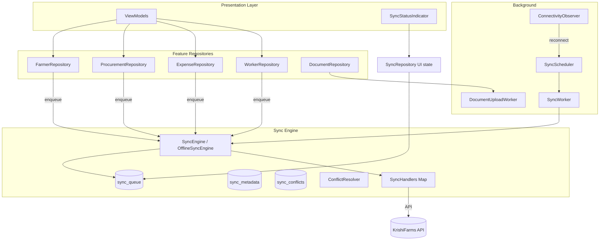
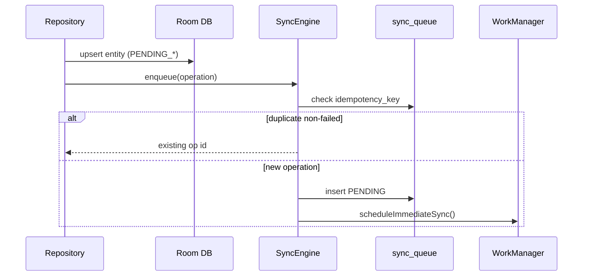
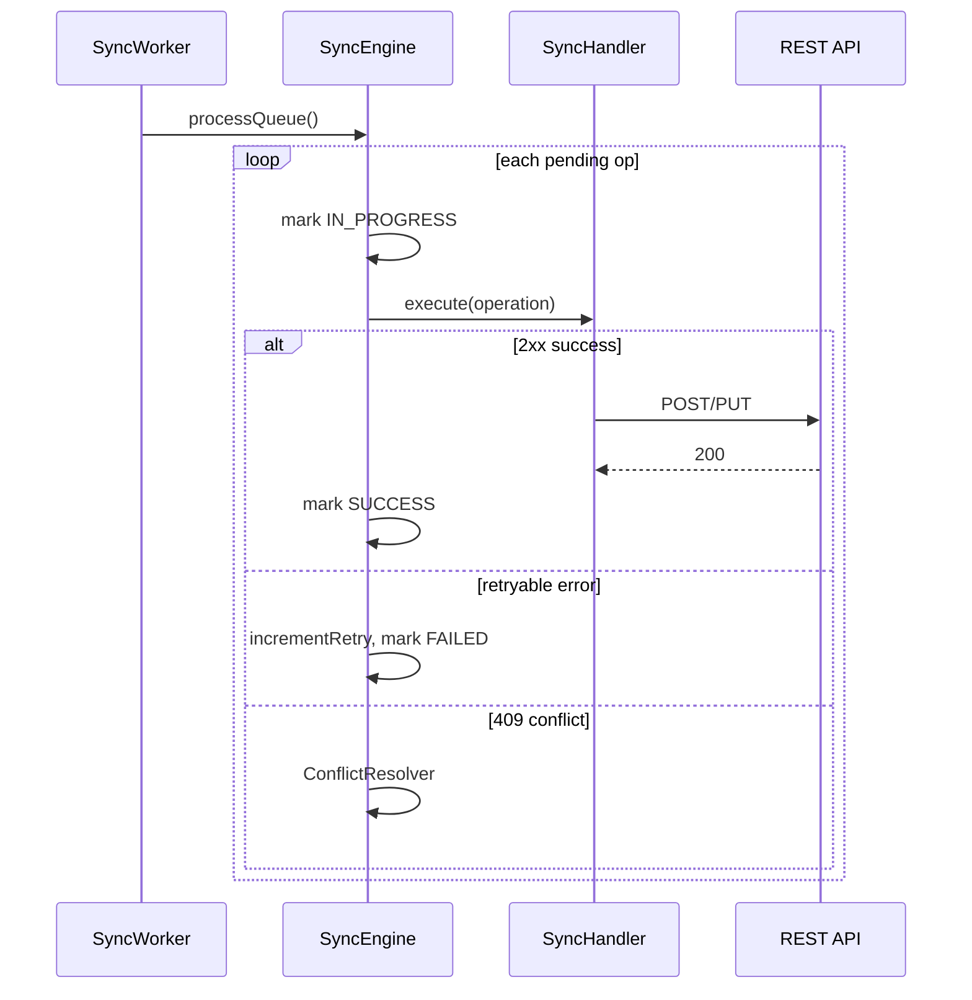
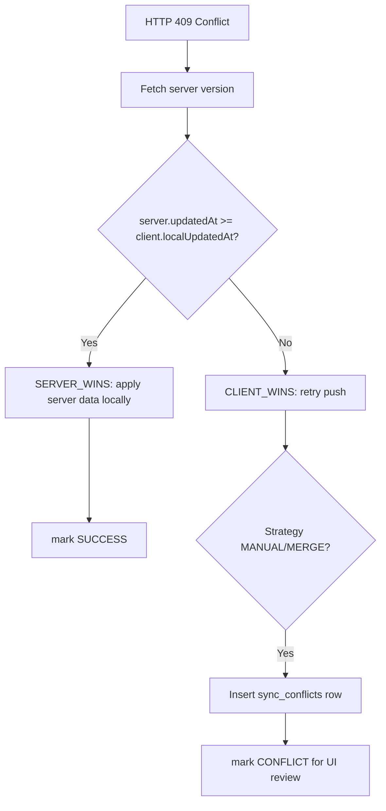

# KrishiFarms Mobile — Offline-First Sync Engine

This document describes the centralized offline-first synchronization architecture for KrishiFarms Mobile. It replaces per-feature ad-hoc sync (`ProcurementSyncWorker`, `ExpenseSyncWorker`, inline `syncPending()` calls) with a single **SyncEngine**, **Room sync queue**, and **WorkManager** orchestration.

## Goals

- **Offline-first**: All writes go to Room first; network sync is asynchronous.
- **Durability**: Pending operations survive app restarts via `sync_queue`.
- **Idempotency**: Client-generated IDs and `Idempotency-Key` headers prevent duplicate server records.
- **Resilience**: Exponential backoff via WorkManager; partial failure does not block the entire queue.
- **Conflict handling**: Default `SERVER_WINS` with `lastModifiedAt` comparison; optional manual review.

## Architecture Overview

## Core Components

### 1. Sync Queue (`SyncOperationEntity`)

| Column | Purpose |
|--------|---------|
| `entity_type` | `FARMER`, `EXPENSE`, `PROCUREMENT`, `WORKER`, `DOCUMENT` |
| `entity_id` | Local or server ID |
| `operation_type` | `CREATE`, `UPDATE`, `DELETE` |
| `payload_json` | Serialized request body |
| `idempotency_key` | Dedup key (typically `local_{uuid}`) |
| `status` | `PENDING`, `IN_PROGRESS`, `SUCCESS`, `FAILED`, `CONFLICT` |
| `retry_count` / `max_retries` | Retry budget (default 5) |
| `priority` | Higher priority ops processed first |
| `error_message` | Last failure reason |

### 2. Entity Sync Status (`SyncMetadata` embedded)

Existing entities use `SyncStatus` on embedded metadata:

- `SYNCED`, `PENDING_CREATE`, `PENDING_UPDATE`, `PENDING_DELETE`, `SYNC_FAILED`

Repositories set pending status locally, then enqueue a queue operation.

### 3. Sync Handlers

`SyncHandler` interface with Hilt multibinding (`@StringKey("FARMER")`, etc.):

| Handler | API | Notes |
|---------|-----|-------|
| `FarmerSyncHandler` | `FarmerApiService` | CREATE/UPDATE/DELETE |
| `ProcurementSyncHandler` | `ProcurementApi` | CREATE + attachment upload |
| `ExpenseSyncHandler` | `ExpenseApiService` | CREATE/UPDATE |
| `WorkerSyncHandler` | `WorkerApiService` | CREATE/UPDATE |
| `DocumentSyncHandler` | `DocumentApiService` | Queue-based upload (optional) |

**Documents** also use a dedicated `DocumentUploadWorker` for large multipart uploads with its own backoff — integrated alongside the central engine.

### 4. WorkManager

| Worker | Trigger | Constraints |
|--------|---------|-------------|
| `SyncWorker` | Periodic (15 min) + immediate on enqueue/reconnect | `NetworkType.CONNECTED` |
| `DocumentUploadWorker` | Per-document upload schedule | `NetworkType.CONNECTED` |

Backoff: `BackoffPolicy.EXPONENTIAL`, 30s initial delay.

### 5. Connectivity

`ConnectivityObserver` emits `Flow<Boolean>` with validated internet. `SyncReconnectCoordinator` schedules immediate sync when connectivity is restored.

## Sync Flow

### Enqueue Path

### Process Queue Path

## Scenario Handling

### 1. No Internet

1. User saves farmer/procurement/expense/worker → written to Room with `PENDING_*`.
2. `SyncEngine.enqueue()` inserts into `sync_queue` with `PENDING`.
3. `SyncWorker` runs but `NetworkMonitor.isOnline()` is false → skips processing.
4. `SyncStatusIndicator` shows offline + pending count.
5. On reconnect, `SyncReconnectCoordinator` triggers immediate `SyncWorker`.

### 2. Weak Internet (partial failure)

1. `SyncWorker` processes queue sequentially by priority.
2. Transient errors (5xx, timeout, `IOException`) → `RetryableFailure` → `retry_count++`, status `FAILED`.
3. WorkManager exponential backoff re-runs worker.
4. Successful ops are marked `SUCCESS` and pruned after 7 days; failed ops remain for retry until `max_retries`.
5. Other pending ops continue processing (partial failure isolation per operation).

### 3. Duplicate Submissions

1. **Client UUID**: `IdGenerator.newLocalId()` → `local_{uuid}` used as entity ID.
2. **Idempotency key**: Same local ID sent as `idempotency_key` column and `Idempotency-Key` HTTP header.
3. **Queue dedup**: `SyncQueueDao.getByIdempotencyKey()` — if a non-`FAILED` op exists, enqueue is skipped.
4. **Server dedup**: Backend returns existing record for duplicate idempotency keys (2xx, not a new duplicate row).

## Conflict Resolution

**Default strategy**: `SERVER_WINS` with timestamp comparison.

| Strategy | Behavior |
|----------|----------|
| `SERVER_WINS` | Apply server snapshot when server `updatedAt` is newer |
| `CLIENT_WINS` | Re-execute push operation |
| `MERGE` / `MANUAL` | Store `SyncConflictEntity` for debug screen review |

## Integration Points

Repositories refactored to use `OfflineSyncEngine.enqueue()`:

- `FarmerRepositoryImpl` — farmer CRUD
- `ProcurementRepositoryImpl` — procurement create (replaces `ProcurementSyncWorker` scheduling)
- `ExpenseRepositoryImpl` — expense create
- `WorkerRepositoryImpl` — worker save

Legacy feature workers (`ExpenseSyncWorker`, `ProcurementSyncWorker`) now delegate to `syncPending()` → `processQueue()` for backward compatibility.

## DI Modules

| Module | Provides |
|--------|----------|
| `SyncBindingsModule` | Handler multibindings, `OfflineSyncEngine`, `ConnectivityObserver` |
| `SyncModule` | `Map<SyncEntityType, SyncHandler>` |
| `SyncInfrastructureModule` | `WorkManager`, `ExpenseApiService`, `DocumentApiService` |
| `DatabaseModule` | `SyncQueueDao`, `SyncMetadataDao`, `SyncConflictDao` |

## UI

- `SyncStatusIndicator` — pending count, offline, syncing states
- `SyncDebugScreen` — lists `FAILED` / `CONFLICT` queue items (settings/debug)

## Logging

`SyncLogger` / `AndroidSyncLogger` tags all engine events with `SyncEngine` for logcat filtering.

## Database Schema Version

Room database version **4** includes:

- `sync_queue` (upgraded `SyncOperationEntity`)
- `sync_metadata` (per-entity-type last sync timestamp)
- `sync_conflicts` (manual resolution queue)

Uses `fallbackToDestructiveMigration()` during active development on `initial-commit` branch.
